### 1. Route BLAU - PTF 1 (9 AdZS / 5 NTP)
<a href="https://goo.gl/maps/tZ7YAcfjz9jn286BA">Google Maps Link</a>
<a href="Routen.content/routen_1a.PNG">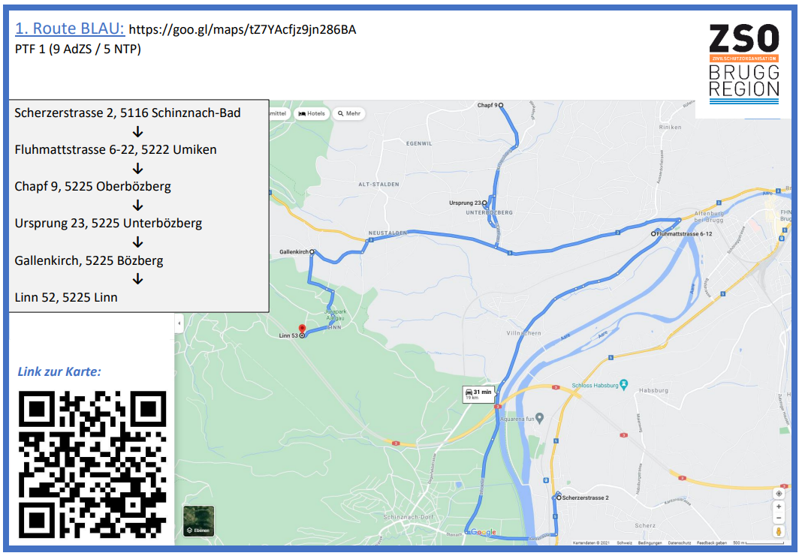</a>
<a href="Routen.content/routen_1b.PNG">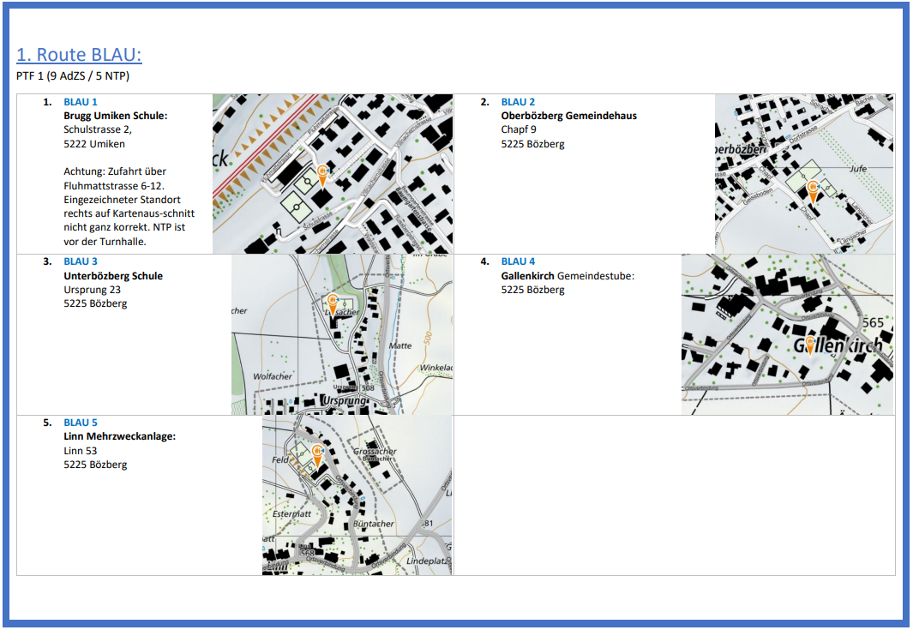</a>

### 2. Route GELB - PTF 2 (9 AdZS / 5 NTP)
<a href="https://goo.gl/maps/dbP28THNh23jykE8A">Google Maps Link</a>
<a href="Routen.content/routen_2a.PNG">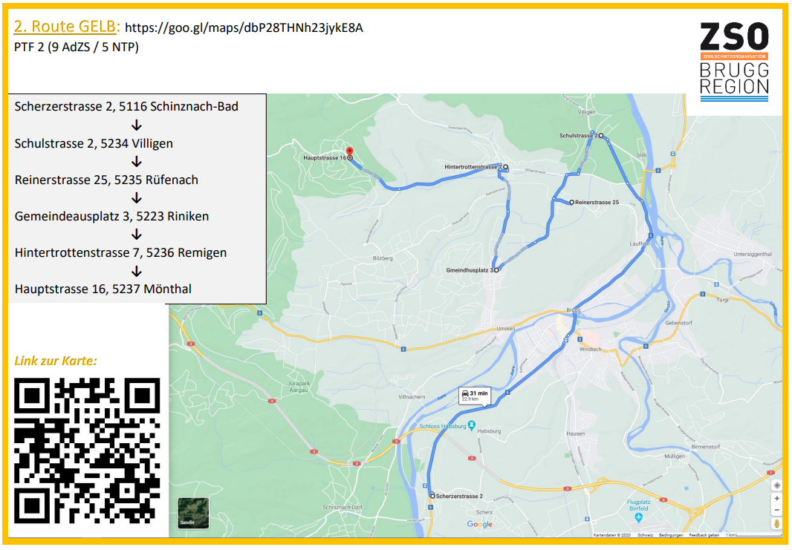</a>
<a href="Routen.content/routen_2b.PNG">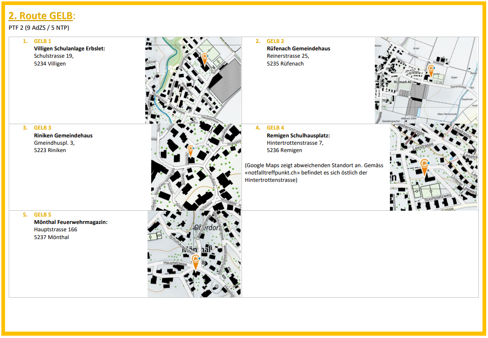</a>

### 3. Route ROT - PTF 3 (9 AdZS / 5 NTP)
<a href="https://goo.gl/maps/jZynmp1ZeEsFeHYw7">Google Maps Link</a>
<a href="Routen.content/routen_3a.PNG">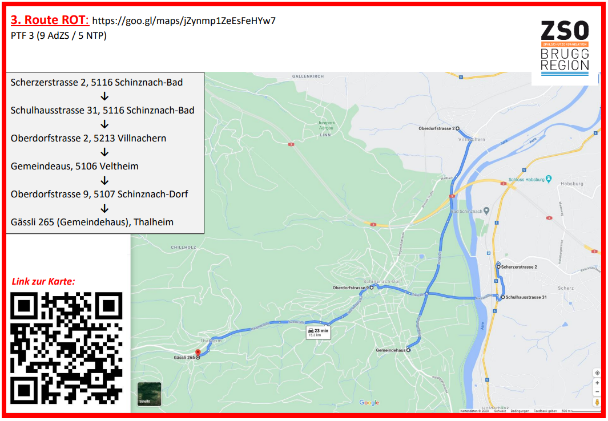</a>
<a href="Routen.content/routen_3b.PNG">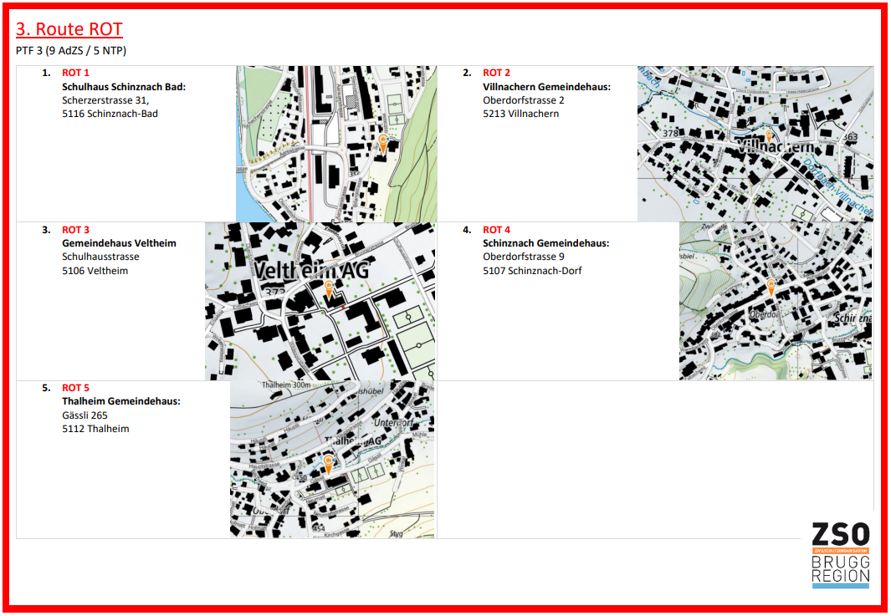</a>

### 4. Route ORANGE - PTF 4 (9 AdZS / 5 NTP)
<a href="https://goo.gl/maps/9BJYkSJ1u9qvh3oA6">Google Maps Link</a>
<a href="Routen.content/routen_4a.PNG">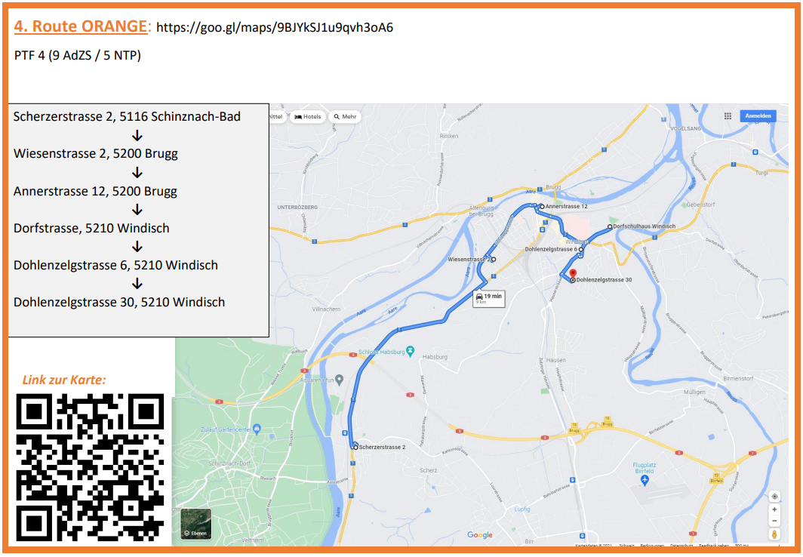</a>
<a href="Routen.content/routen_4b.PNG">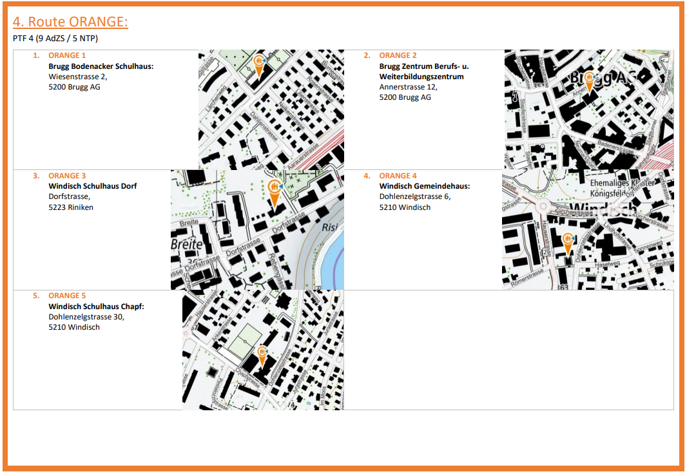</a>

### 5. Route GR&Uuml;N - PTF 5 (9 AdZS / 4 NTP)
<a href="https://goo.gl/maps/98JsmDqi1B1Y76SH9">Google Maps Link</a>
<a href="Routen.content/routen_5a.PNG">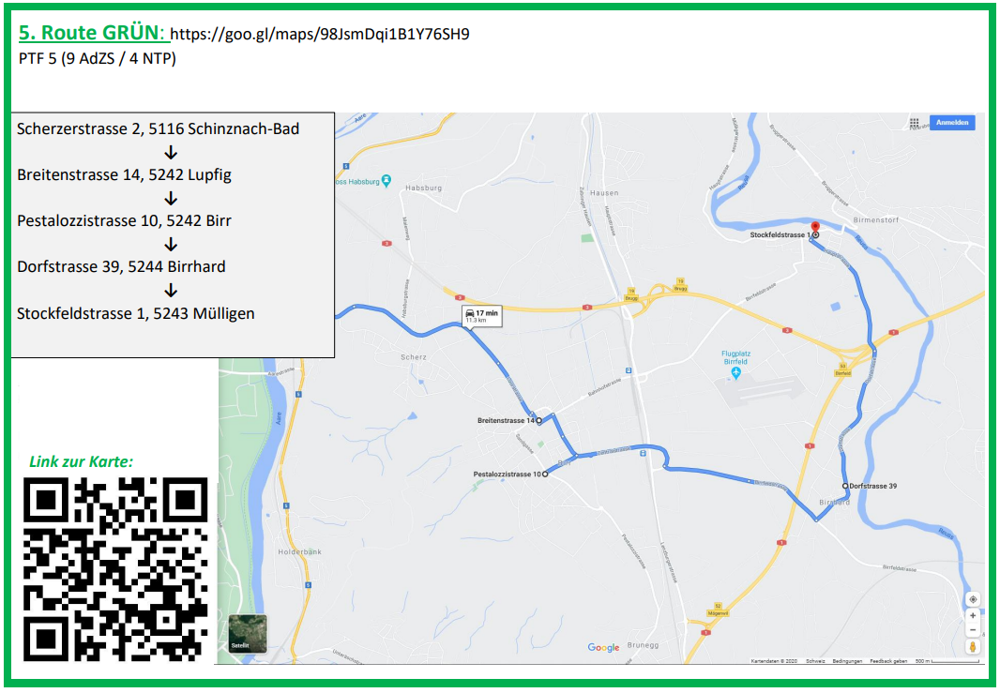</a>
<a href="Routen.content/routen_5b.PNG">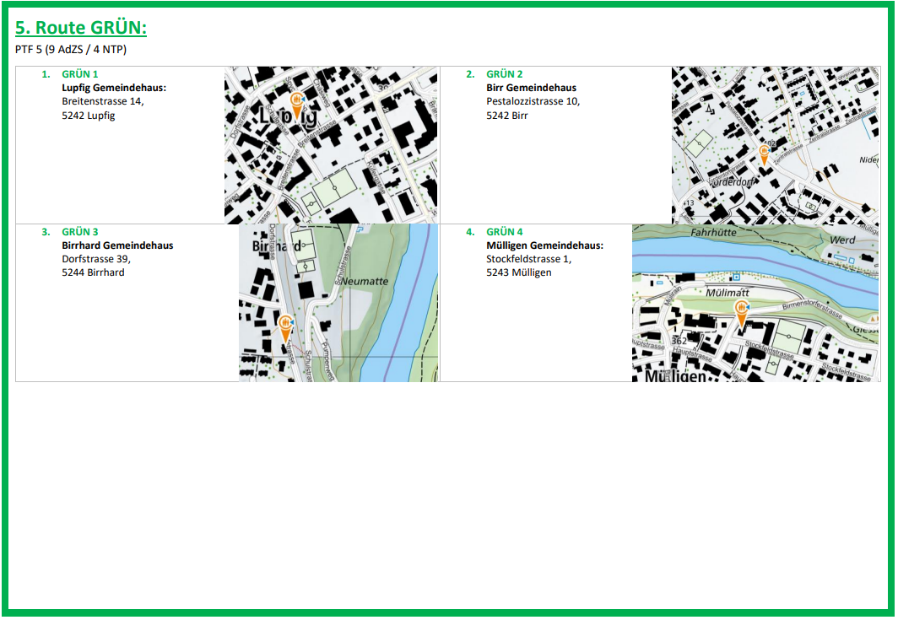</a>

### 6. Route VIOLET - PTF 5 (9 AdZS / 4 NTP)
<a href="https://goo.gl/maps/YYHFJrERxpgrbeiQ6">Google Maps Link</a>
<a href="Routen.content/routen_6a.PNG">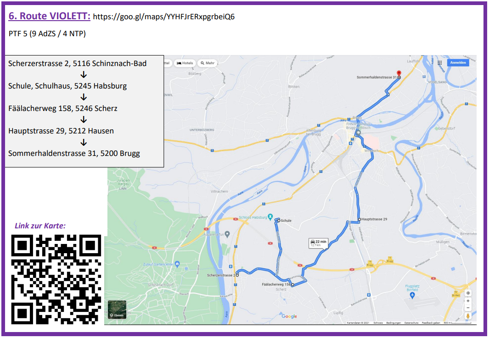</a>
<a href="Routen.content/routen_6b.PNG">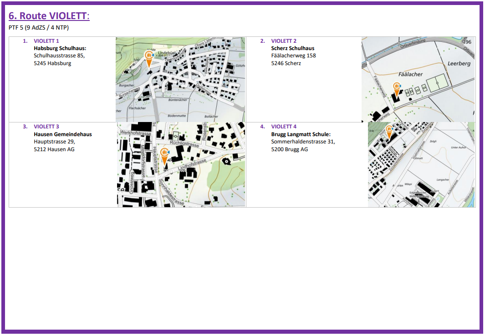</a>

 
Routen PDF [Download (2.54MB)](NTP_Konzept_Routenplan_6MF_Karten.pdf) (iPhone nach rechts swipen f&uuml;r zur&uuml;ck)
 
 
