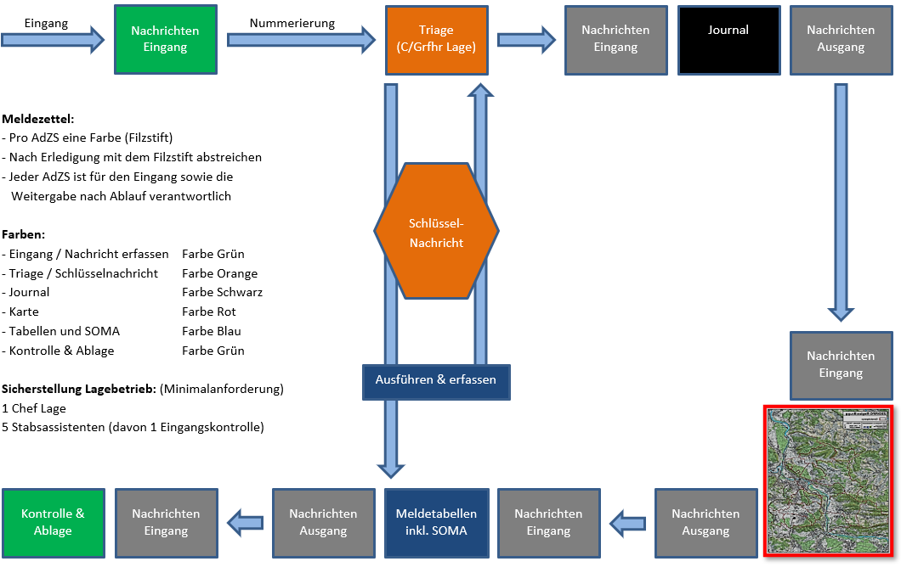
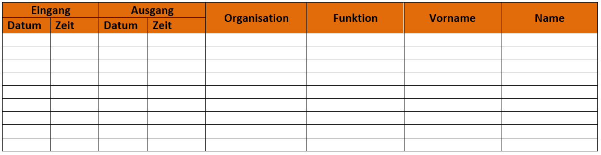
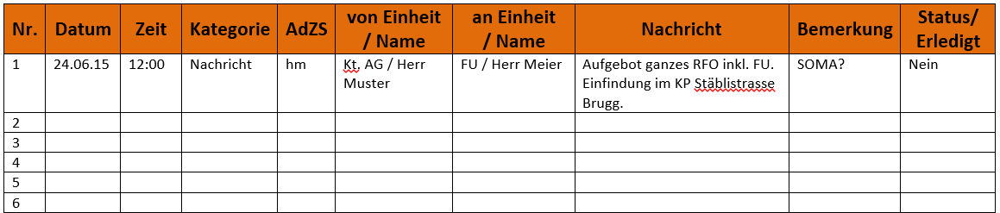
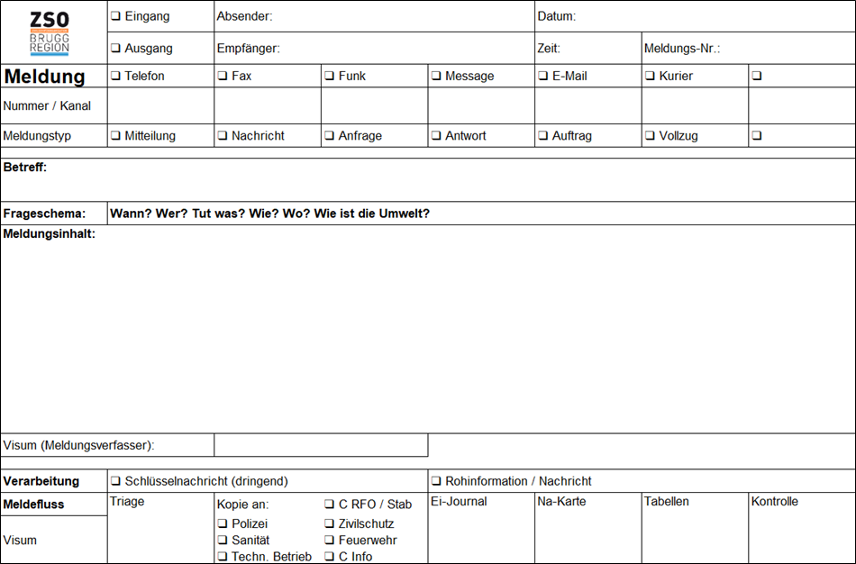

## Fachbereich Lage

### Funktionsübersicht

#### Chef Lage
* Ausrichten der Köpfe des Lageorgans auf die Vorgaben der Führung
* Beeinflussen der Tätigkeiten im Lageverarbeitungszyklus
* Verfolgen der Lageentwicklung im Sinne der Lagekontrolle
* Erkennen von Widersprüchen, Fehlern und Lücken im Lagebild
* Erfassen und Strukturieren der Lageelemente zu einem Lagebild
* Entwickeln der Lagebeurteilung insbesondere auch von Entwicklungsmöglichkeiten 
* Präsentation Lagebild

*Siehe Handkarte C Lage*

#### Grfhr. Lage
* Führt die Stabsassistenten an.
* Gibt den Arbeitsauftrag an die Stabsassistenten weiter.
* Ist zusammen mit dem Chef Lage für die Schulungen der Stabsassistenten im Fachbereich Lage mitverantwortlich.

#### Eingangskontrolle
* Kontrolliert jede Person, welche in den Führungsraum eintreten will und überprüft deren Befugnis den Raum zu betreten (Befugnis haben alle Blaulichtorganisationen, techn. Betriebe, ZSO/RFO, Militär).
* Bei Unklarheiten muss der Stabschef informiert werden.

Sämtliche Personen, welche den Raum betreten, werden auf der Checkliste eingetragen. Die Checkliste Eingangskontrolle sollte immer folgende Angaben enthalten:
* Eingang (Datum/Uhrzeit)
* Ausgang (Datum/Uhrzeit)
* Organisation
* Funktion
* Vorname
* Name

*Siehe Mustereingangskontrolle*

#### Telefon/Funk

#### Triage
* C Lage / Grfhr Lage / Notfall Stabsassistent
* Erhält sämtliche Meldezettel/Meldungen vom Telefonisten/Funker und beurteilt diese.
* Die Schlüsselnachrichten sind speziell als solche zu kennzeichnen, werden kopiert und die Kopie direkt (dringend!) an den Stabschef abgegeben.
* Nach Erledigung muss der originale Meldezettel signiert und an den Journalführer weitergegeben werden.
* Wenn die Meldungen vom Tabellenführer zurückkommen, müssen diese kontrolliert (Nummerierung fortlaufend / alle Signaturen vorhanden) und nochmals signiert werden.

*Siehe Lage- und Verarbeitungszyklus*

#### Journal
* Sämtliche Meldungen, welche von der Triage kommen, werden im Journal aufgelistet (keine Interpretation!) und mit allen nötigen Informationen versehen.
* Schlüsselnachrichten sollen rot markiert werden.
* Nach Erledigung muss der Meldezettel signiert und vom Kartenführer abgeholt werden.

*Siehe Lage- und Verarbeitungszyklus sowie Musterjournal*

Der Aufbau eines Journals muss immer gleich aussehen. Folgende Informationen müssen darauf ersichtlich sein:
* Datum, Uhrzeit
* Kategorie (Schlüsselnachricht / Nachricht / etc.)
* Stabsassistent (Kürzel des Erfassers)
* Von (Einheit, Name)
* An (Einheit, Name)
* Nachricht
* Bemerkungen
* Status (Erledigt (Ja/Nein))

*Siehe Musterjournal*

#### Kartenführer
* Holt die Meldungen beim Journalführer ab (Kommunikation).
* Zeichnet unter Berücksichtigung der offiziellen Signaturen und Farbschemen die Ereignisse und Situationen, welche über die Meldungen vom Journalführer kommen, auf der Karte ein (keine Interpretationen!).
* Nach Erledigung muss der Meldezettel signiert und an den Tabellenführer weitergegeben werden.

*Siehe Lage- und Verarbeitungszyklus*

#### Tabellenführer
* Sämtliche Meldungen, welche von der Kartenführung kommen, müssen auf den Meldetabellen (Mitteltabelle, Schlüsselnachrichten, SOMA, Anträge / Pendenzen, erhaltene und erteilte Aufträge) aufgelistet werden (keine Interpretationen!).
* Nach Erledigung muss der Meldezettel signiert und an die Triage zur Kontrolle abgegeben werden.
Siehe Lage- und Verarbeitungszyklus

### Aufbau und Betrieb: Telematik

1. Eingangkontrolle sicherstellen (und erfassen der bereits Anwesenden)
2. Aufbau des Lagebetriebs
3. Informationen vom Fachbereich Telematik einfordern
4. Lage- und Verarbeitungszyklus sicherstellen

#### Räumlichkeiten
* Führungsraum für Rapporte
* Arbeitsraum Chef RFO / Stabchef
* Arbeitsräume RFO
* Lagezentrum
* Telematikzentrum
* Kanzlei
* Weitere Räumlichkeiten nach Bedarf
* Beschilderung KP Aussen

#### Aufbau Lage
* Jounral - elektronisch erfassen
* Journal am Beamer visualisieren
Gliederung wie folgt:
* Rapport
* Karte (1 x Übersicht, 1 x Detail)
* Mitteltabelle
* Schlüsselnachrichten
* Sofortmassnahmen (SOMA)
* Anträge/Pendenzen
* Erhaltene Aufträge
* Erteilte Aufträge
* IES einrichten

#### Peripheriegeräte
* Drucker / Kopierer / Scanner
* Visualizer (Dokumentenkamera)
* Beamer und Grossbildschirm
* Smartboard (elektronische Wandtafel)

**Hinweis:** Peripherie- und Telematikgeräte müssen in genügender Anzahl bereitstehen und zeitgerecht betriebsbereit und durchhaltefähig sein (Notstrom und geladene Reeserve-Akkus).

### Muster-Vorlagen

### Lage-Verarbeitungszyklus

### Muster-Eingangskontrolle

### Muster-Journal

### Meldezettel

 