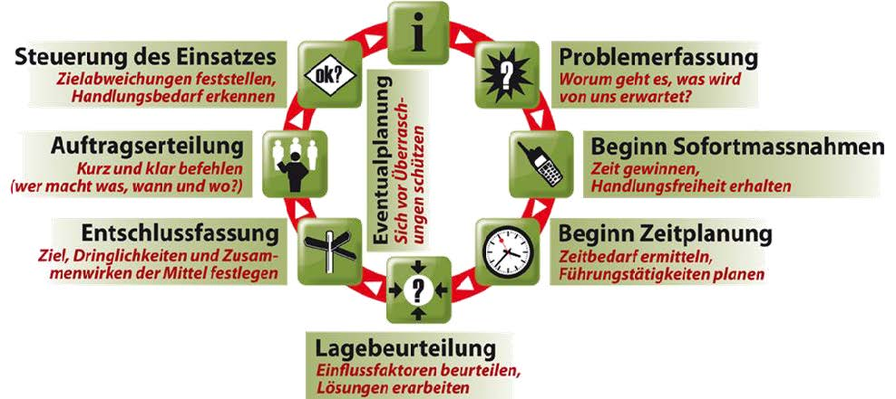

## Führungstätigkeiten Lage

### Auftrag / Lage 
Die Führungstätigkeiten umfassen alle Tätigkeiten eines Füh-rungsorgans, vom Feststellen einer Lage bzw. vom Entgegen-nehmen eines Auftrages bis zur Erfüllung der Aufgabe. Sie be-ginnen mit jeder Veränderung der Lage oder des Auftrages erneut.

### Problemerfassung 
Die Problemerfassung ist die erste Auseinandersetzung mit einer Lage oder einem Auftrag. Das richtige Erfassen der Aufgabe und das Erkennen der Teilprobleme bilden die Voraussetzung für das Erfüllen der Aufgabe und zeigen den Weg zur Entschlussfassung auf.

### Beginn Sofortmassnahmen 
Mit Sofortmassnahmen können Zeitverluste vermieden und Grundlagen für die Beurteilung der Lage beschafft werden. Die Hand-lungsfreiheit muss jedoch erhalten bleiben.

### Beginn Zeitplanung 
Im Zeitplan wird festgelegt, bis zu welchem Zeitpunkt die einzelnen Führungstätigkeiten abgeschlossen sein müssen (interner Zeit-plan), damit die involvierten Führungsorgane genügend Zeit für ihre Führungstätigkeiten haben und die Einsatzorganisationen zeitgerecht handeln können (externer Zeitplan).

### Lagebeurteilung 
Die Lagebeurteilung basiert auf den Resultaten der Problemerfassung und dem aktuellen Lagebild. Die Beurteilung der Lage geht von einer Sammlung von Aussagen (Fakten) aus, verdichtet diese zu Erkenntnissen und leitet daraus handlungsorientierte Konsequenzen ab. Die Lagebeurteilung soll zudem Entwicklungsmöglichkeiten aufzeigen.

Lösungsvarianten sind unterschiedliche Synthesen der Inhalte der Konsequenzenliste. Sie beschreiben je einen Weg, der zum Ziel führt. Aufgelistete Vor- und Nachteile lassen eine Bewertung zu. Die Präsentation der Lösungsvarianten verlangt einen begründeten Antrag für eine Variante.

### Entschlussfassung 
Die Entschlussfassung erfolgt anhand der beantragten Lösungsmög-lichkeiten und legt im Entschluss die Absicht für das weitere Vorgehen fest.

Bereits während der Lagebeurteilung - spätestens aber nach dem Ent-scheid über das weitere Vorgehen - muss nach weiteren Massnahmen je nach Lageentwicklung gefragt werden: „Was wäre, wenn …?“ Vorbehaltene Entschlüsse können hier integriert werden.

### Auftragserteilung 
Die Auftragserteilung regelt die Umsetzung der Aktion konkret. Je nachdem, an wen die Aufträge gerichtet sind, müssen die Lösungs-konzepte, die aus der Lagebeurteilung hervorgegangen sind, vorgängig zu detaillierten Planungen verarbeitet werden (Einsatzplanung). In der Auftragserteilung werden sie in einer standardisierten Struktur kommuniziert (Orientierung, Aufträge, Besondere Anordnungen - OAB).

### Steuerung des Einsatzes 
Zielabweichungen und Lageveränderungen müssen rechtzeitig erkannt werden. Eine neue Lage erfordert eine erneute Problemerfassung. Für die frühzeitige Erkennung von allfälligem Handlungsbedarf eignen sich Lagerapporte, aber auch ein Augenschein vor Ort.

## Aufbau Führungswand im Führungsraum

Eine sachlogisch aufgebaute **Führungswand** orientiert sich am Führungsprozess und damit an den Teilschritten der systematischen Problemlösung. Sie beinhaltet Darstellungen, welche von der Visualisierung der Problemerfassung bis zu Angaben über die Ereignisbewältigung reichen.

Der **Beitrag** aus dem **Sachbereich Lage** sind die Produkte **Führungskarte** (je nach gewünschtem Detaillierungsgrad auch **Nachrichtenkarte**) und **Fakten-Flash**, dazu **Dispositiv** und eine ganzheitliche **Mittelübersicht**. Bei der **Lagebeurteilung** kommt es auf die Vorgaben des Führungsverantwortlichen an, inwieweit der Sachbereich Lage involviert ist.

Die **weiteren Darstellungen** sind fachlich durch den entsprechenden Stab oder das Führungsorgan zu führen. Der **Sachbereich Lage** kann hier allenfalls **Hilfestellung** zur **kreativen Darstellung** von vorgegebenen Sachverhalten bieten. In der Praxis wird die Führung bestimmter Darstellungen einzelnen Stabsmitarbeitern (allenfalls auch dem Sachbereich Lage) zugewiesen.
