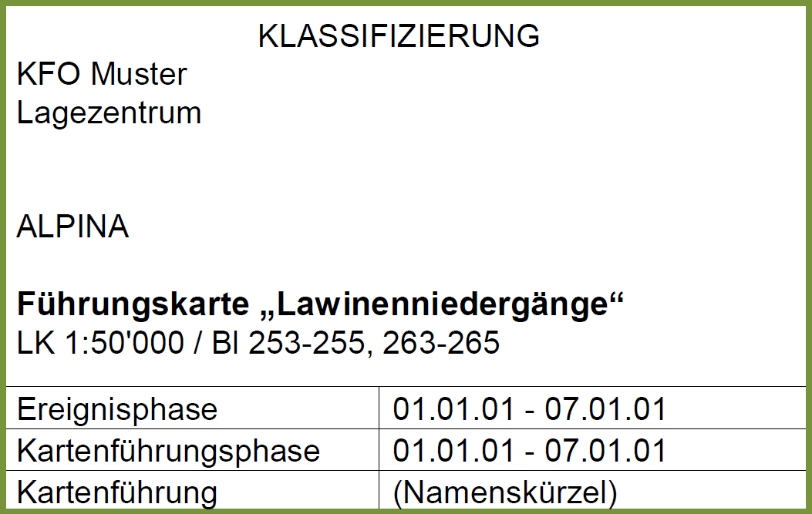
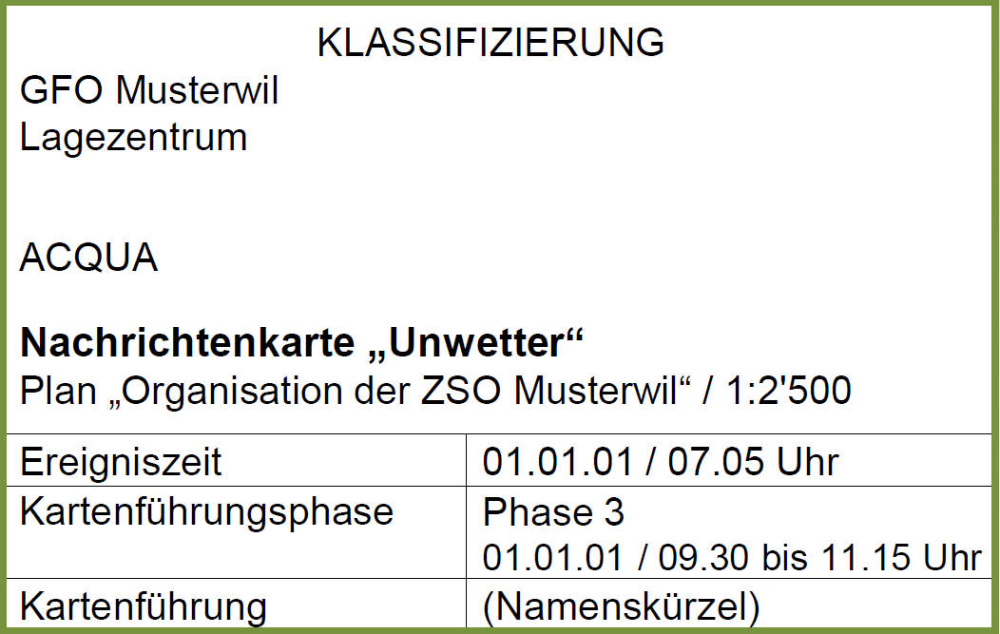
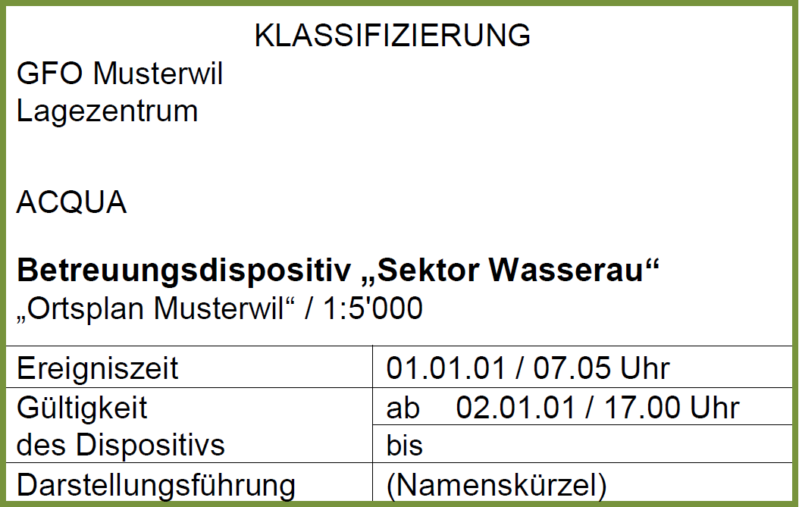

## Hinweise zur Kartenführung
* Der Kartenmassstab muss dem Verwendungszweck angepasst sein.
* Eingetragen werden Koordinatenkreuze (diagonal auseinanderliegend) und allenfalls die Nordrichtung, dazu kommt die Kartenbeschriftung.
* Die im Lageverbund definierten Signaturen können - wenn dies Sinn macht - mit der Ereigniszeit (nicht Meldezeit) ergänzt werden (in der Farbe der Signatur).
* Die Personenbergungsübersicht wird an einem vom Ereignis nicht betroffenen Ort gezeichnet.
* Mittel, die auf dem selben Schadenplatz im Einsatz sind, werden herausgezogen und mit Hilfe eines Rahmens zusammengefasst (analog Personenbergungsübersicht).
* Damit die Übersichtlichkeit auf der Karte jederzeit gewährleistet ist, wird empfohlen, von Zeit zu Zeit (im Rahmen einer neuen Kartenführungsphase) die Kunststofffolie bzw. den Kartenlayer zu wechseln.

## Beschriftungsnormen für Karten bzw. Pläne

 

 

## Beschriftungsnormen für Darstellungen

 

 