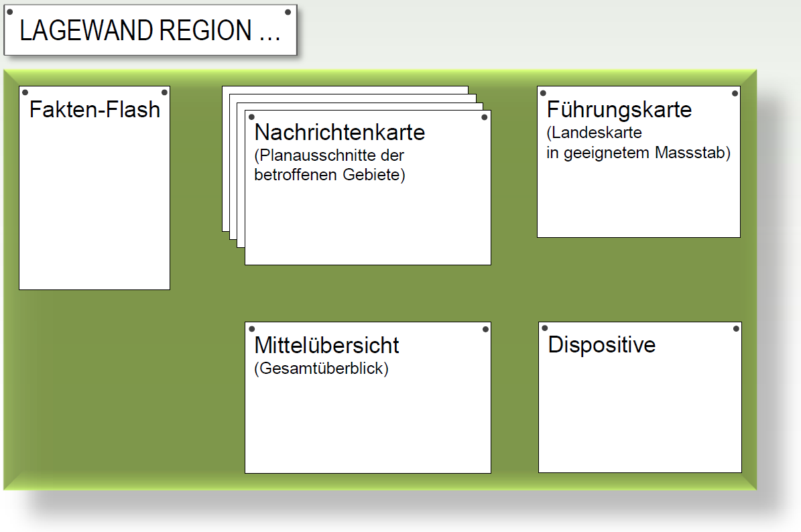

Der **Standort**, die **Einrichtungen** sowie die **Telematikmittel** bilden wesentliche **Voraussetzungen** zur **effizienten Stabsarbeit**. Die zur Verfügung stehende Infrastruktur beeinflusst die Stabsarbeit nachhaltig.

Der Standort des **KP Front** (sprich der Einsatzleitung) wird vom **Einsatzleiter** festgelegt. Der **KP Rück** (Basis) sowie die **KP** von **Führungsorganen sind in der Regel für den Einsatz vorbereitet**.

Der Ausbau der Führungsstandorte bezüglich Räumlichkeiten (z.B. Räume zur Unterteilung des Lagezentrums in Arbeitszellen, Verpflegungsraum, Aufenthaltsraum, Ruheraum und sanitäre Räumlichkeiten) und Infrastruktur richtet sich nach der Einsatzdauer.

Folgende **minimale Anforderungen** müssen aber stets erfüllt sein ...
* **Rapportraum** mit der Auflage, dass zumindest eine Wand als **Führungswand** bewirtschaftet werden kann.
* **Arbeitsräume** bzw. **Arbeitszellen**, die es erlauben, dass die Angehörigen des Führungs- organs ihrer Tätigkeit in Gruppen oder als Einzelner nachgehen können.

## Aufbau Lagewand im Lagezentrum

Die Lagewand sollte die folgenden **Produkte** beinhalten …
* Fakten-Flash mit den wesentlichsten Eckdaten zum Ereignis
* Nachrichtenkarte oder Lageskizze
* Führungskarte (ab Konsolidierungsphase)
* Mittelübersicht (in Absprache mit Ressortverantwortlichen)
* Dispositive (je nach Bedürfnissen des Führungsorgans)

 
