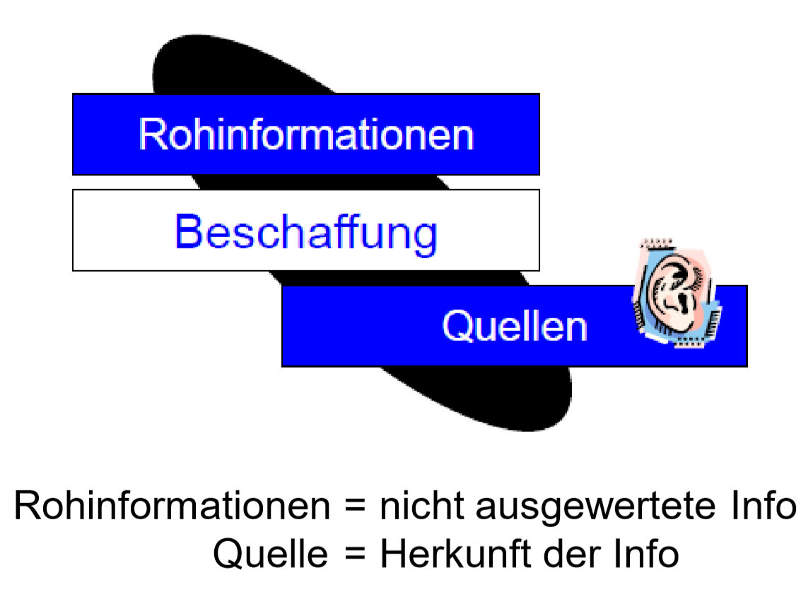
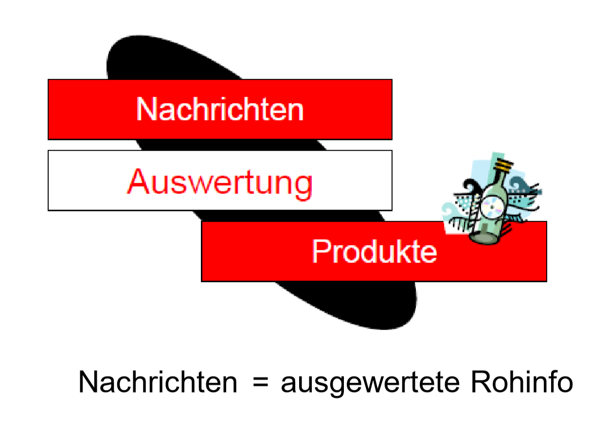
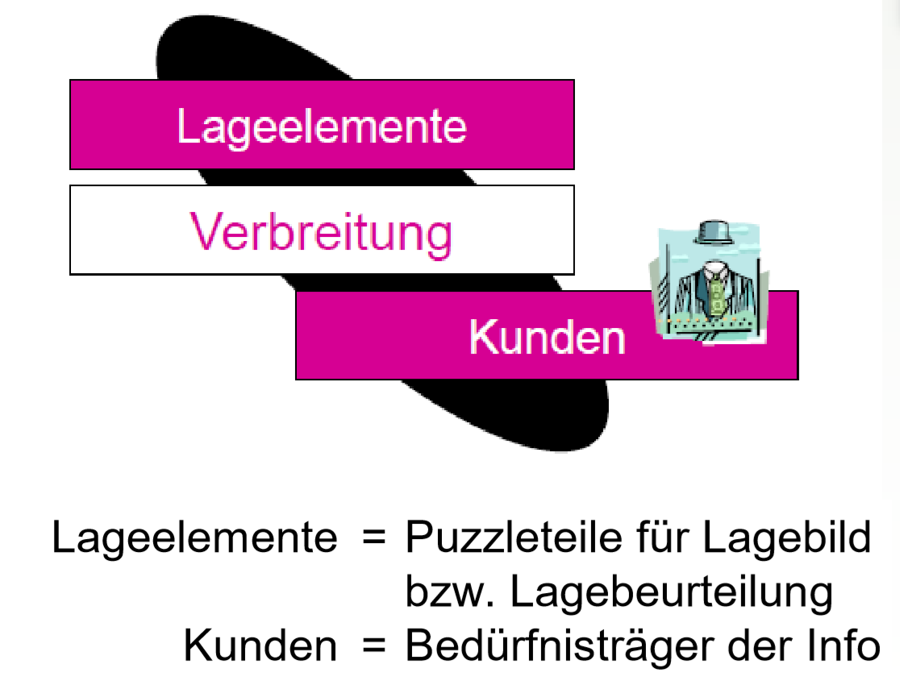
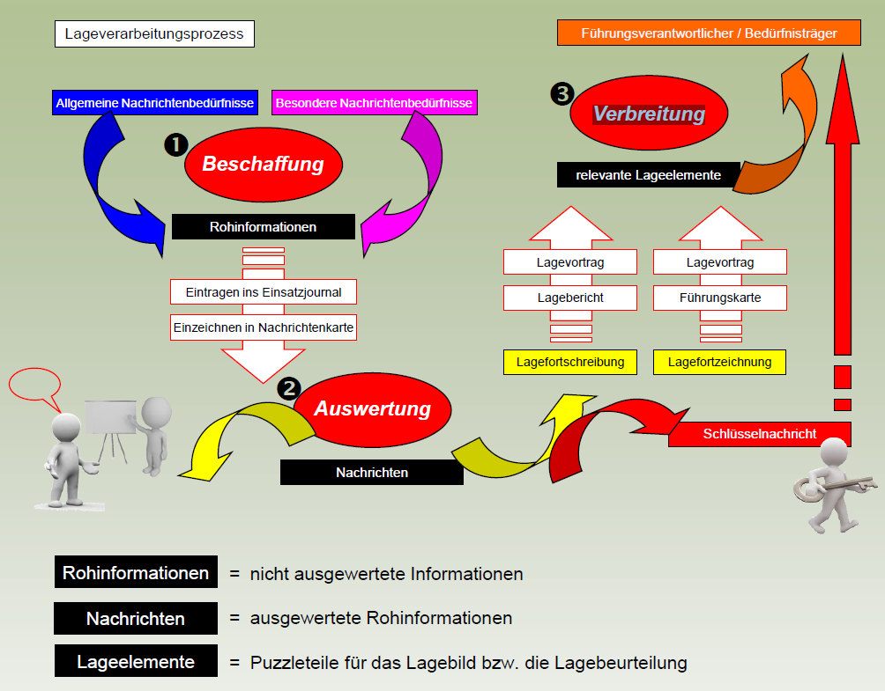

 
Der **Lageverarbeitungszyklus** ist ein **ständig geführter Prozess**, bei dem **Rohinformationen beschafft**, durch die **Auswertung** in **Nachrichten** umgewandelt und verdichtet als führungsrelevante **Lageelemente** an die Bedürfnisträger **verbreitet** werden. Die **Abläufe richten** sich **nach** der **Lageentwicklung**, den **Vorgaben** (Prioritäten) der **Führung** und den verfügbaren **Ressourcen**.

 
## Beschaffung 

Die **Beschaffung** ist ein Prozess, in dem **Rohinformationen selektiert** (ausgewählt) und/oder **beschafft** werden. Die **Beschaffung** umfasst alle Mittel und Methoden zur **Gewinnung** von Rohinformationen für die Auswertung. Dazu gehören **primär Erkundung**, allenfalls **Aufklärung** der Gegenseite, Nachrichtenaustausch, Personenbefragung, Gegenstands- und Objektanalysen sowie z.B. die **Auslese** von **relevanten Aspekten** aus **Medien**.

Bei **Alltagsereignissen** und im **Katastrophenfall** sind es vorwiegend die Organe und Mittel von **Polizei** und **Feuerwehr**, welche die notwendigen Achsen-, Ziel-, Objekt- und Raumerkundungen vornehmen und auch Behörden bzw. Führungsorgane mit ihren Beschaffungsergebnissen aufdatieren.

 
## Auswertung 

Die **Auswertung ordnet**, **verknüpft** und **verdichtet** die eingehenden Meldungen und wandelt diese in einem Denkprozess von **Rohinformationen** in **Nachrichten** bzw. **führungsrelevante Lageelemente** um. Die Auswertung beinhaltet eigentlich die Schritte - **Analyse, Vergleich, Interpretation, Integration, Verdichtung** und **Bewertung**. Der im Lagezentrum eingehende, zeitlich, räumlich und thematisch ungeordnete Meldefluss wird dabei in **Text** (Einsatzjournal, Lagebericht) und **Karte** (Nachrichtenkarte, Führungskarte) parallel verarbeitet.

 
## Verbreitung 

Die **Verbreitung stellt** der eigenen Führung und den Partnern im Lageverbund **zeit-** und **stufengerecht** die notwendigen **Produkte zur Verfügung**. Diese enthalten die relevanten **Lageelemente**. Das Verbreiten verpflichtet zum **Dialog mit dem Empfänger** bezüglich Qualität und den Kundenbedürfnissen.

 
## Der Lageverarbeitungszyklus = Beschaffung - Auswertung - Verbreitung

 
 