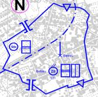
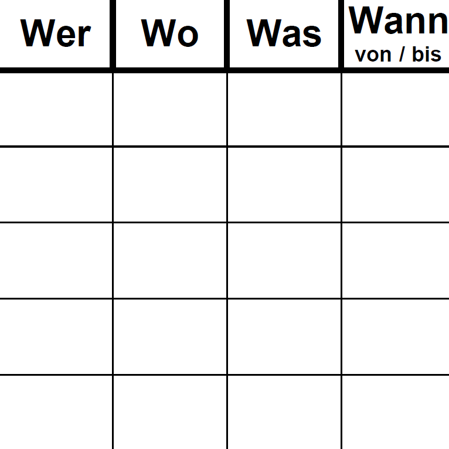
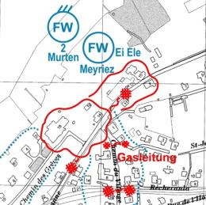
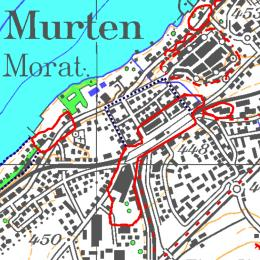

 
Zum **minimalen Produktestandard zur Lagebewirtschaftung** zählt man im Lageverbund ...

 
## Einzelnachricht
Als Einzelnachrichten werden Schlüsselnachrichten und Antworten auf besondere Nachrichtenbedürfnisse sowie Meldungen über wichtige Einzelaspekte verbreitet. Einzelnachrichten werden zudem in einer Meldungsablage (Ablageordner / EDV-Datenverzeichnis) erfasst. Synonyme für den Begriff Einzelnachricht sind Rohinformation, Nachricht oder Meldung.

 
## Einsatzjournal (Erfassungsprodukt)
Das Einsatzjournal ist ein lückenlos chronologisch geführtes Protokoll, welches sämtliche Daten über einen Ereignisablauf und die getroffenen Massnahmen zur Ereignisbewältigung beinhaltet. Das vollständige Einsatzjournal lässt eine Ereignisrekonstruktion zu und kann die Führung vor ungerechtfertigten Anschuldigungen entlasten (oder bei Fehlern in die Verantwortung nehmen).

 
## Lagebericht (Verdichtungsprodukt)
Der Lagebericht ist das Produkt der verdichteten **Lagefortschreibung** über die aktuelle Lage und orientiert ereignisbezogen über die relevante Lageentwicklung. Dabei wird der Meldefluss laufend nach thematischen, räumlichen oder auch zeitlichen Kriterien zusammengefasst. Er kann sich an die vorgesetzte Stelle, an Nachbarn oder weitere Adressaten richten. Verfasst wird er prägnant, teilweise auch stichwortartig, jedoch so, dass eindeutig ist, wo geografisch, wer oder was wie betroffen ist.*

 
## Dokumentation über den Sachbereich Lage
Die Dokumentation über den Sachbereich Lage enthält längerfristig relevante Unterlagen bzw. Daten über kantons-, einsatzmittel- bzw. organisationsspezifische Belange. Dies können z.B. Checklisten, Prozesse, Verzeichnisse, Quellen oder die Lageverbundorganisation sein.

 
## Dispositiv (Dispositionsprodukt)
Das Dispositiv ist die grafische Darstellung der in der Realität vorhandenen Räume, Begrenzungen, Achsen, Einrichtungen und/oder Standorte eines Krisenraums. Synonyme sind Krisenraumdispositiv oder Schadenplatzorganisation. Aus dem Dispositiv sind die räumliche Gliederung sowie die Standorte der agierenden Einsatzkräfte ersichtlich. Es muss ableitbar sein, wo man sich im Einsatzraum wie (unter welchen Einschränkungen) bewegen kann.

 
## Mittelübersicht (Dispositionsprodukt)
Die Mittelübersicht ist der tabellarische Überblick über die zur Bewältigung einer Lage prinzipiell vorhandenen, vorerst auf Pikett gestellten, bereits auf-gebotenen, einsatzbereiten, eingesetzten und/oder zur Ablösung vorgeseh-enen Einsatzmittel. Sie ist nach Organisationen und/oder Schadenräumen strukturiert und kann Informationen über Personal, Geräte, Fahrzeuge, Maschinen, Leistungsspektrum, Einsatzort, Kommando, Auftrag, Stand der Arbeiten, Logistik und Ablösung enthalten. Am zweckmässigsten ist eine Matrix, welche einfach aktualisierbar ist. Die Mittelübersicht muss auf die Verwendung des Kunden ausgerichtet sein.

 

 
## Nachrichtenkarte (Erfassungsprodukt)
Die Nachrichtenkarte ist ein permanentes Arbeitsinstrument zur laufenden Erfassung und Auswertung des relevanten Meldeflusses im Lagezentrum. Sie enthält Fakten über einen bestimmten Zeitraum (Film von … bis …) und wird detailliert sowie präzis geführt. Die Nachrichtenkarte kann mit Zu-satzelementen wie Flashstreifen (wesentliche Kerndaten oder ergänzende Fakten zum Kartenbild) oder Fotos (z.B. Luftaufnahmen, Bilder von Aus-wirkungen) versehen werden. Dabei ist auf eine sachlogische Anordnung rund um die Karte und auf die Beschränkung aufs Wesentliche zu achten.

 
## Führungskarte (Verdichtungsprodukt)
Die Führungskarte ist das Produkt der verdichteten **Lagefortzeichnung** und beinhaltet das führungsrelevante Lagebild zuhanden des Führungs-verantwortlichen sowie zuhanden von Spezialisten oder eines Stabes. Sie zeigt Fakten zu einem bestimmten Zeitpunkt auf (Foto um …) und ist auf die Vorgaben der Führung ausgerichtet (Prioritäten, Schwergewichte). Eingezeichnet wird nur, was für die Ereignisbewältigung bzw. die Führung relevant ist. Sinnvoll kann eine Raumgliederung sein mit anschliessender Charakterisierung der einzelnen Räume (konkrete Aussagen zu Eigen-heiten, Gefährdungen, Auswirkungen, %-Angaben). Die Führungskarte ist deckungsgleich mit den Aussagen im Lagebericht (Abgleich).

**Prinzipiell gilt**, dass **Zweck, Inhalt, Struktur, Detaillierungsgrad** und **Formales** eines **Produkts im Sachbereich Lage** für Einsatzleitungen, Einsatzzentralen, Basisstandorte, Ein- satzmittel und/oder Führungsorgane **sich richten nach** ...

* der **Lage** und/oder dem **Ereignis** (allenfalls auch nach dem Auftrag),
* den **Bedürfnissen der Benutzer**,
* den **Standardvorgaben** des im **Kanton** zuständigen Sachbearbeiters für den Lageverbund,
* den prozessorientierten **Vorgaben** von **Führungsverantwortlichen** und
* den fachspezifischen **Vorgaben** und **Standards** von **Einsatzorganisationen**.

 
## Situative Produkte
Je nach Bedarf wird der minimale Produktestandard mit **situativen Produkten** ergänzt. Situative Produkte können **ereignisbezogen** oder auch **führungsorientiert** sein. Beispiele von situativen Produkten finden sich im Anhang des BELA.

 
 
 
 