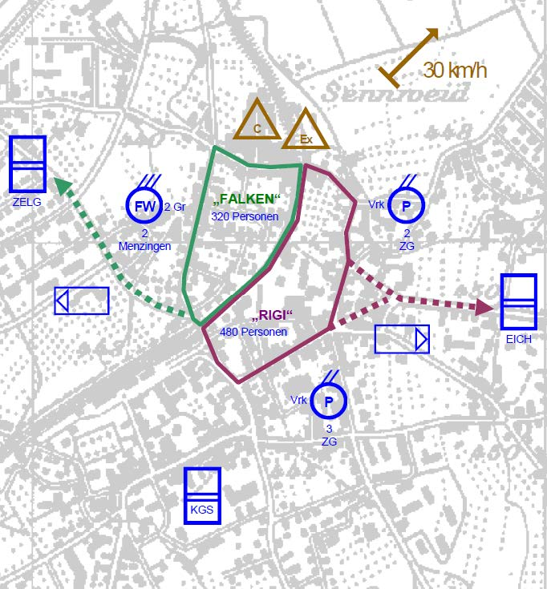
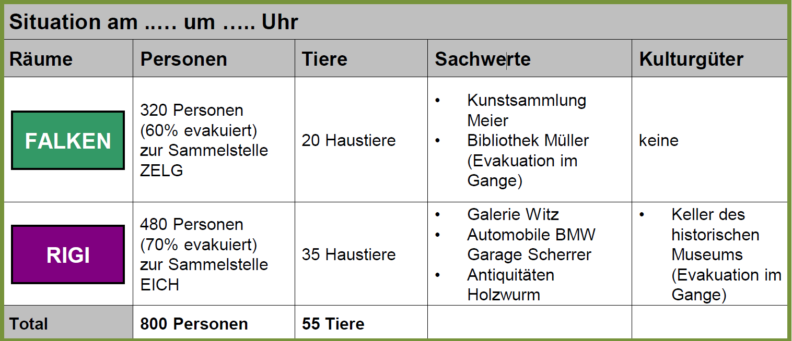
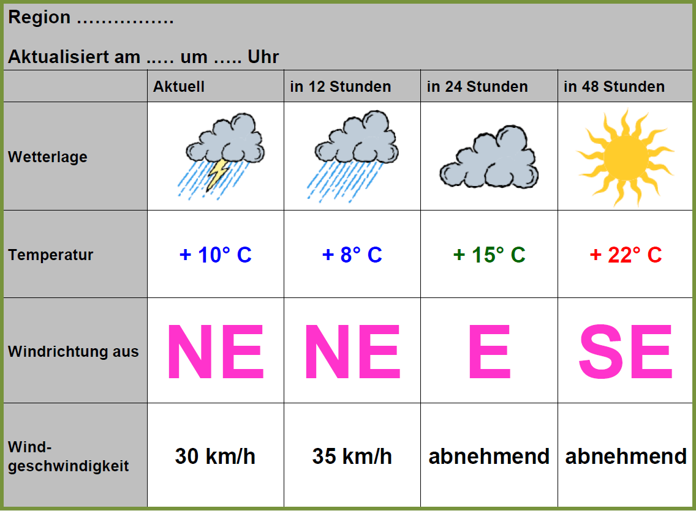
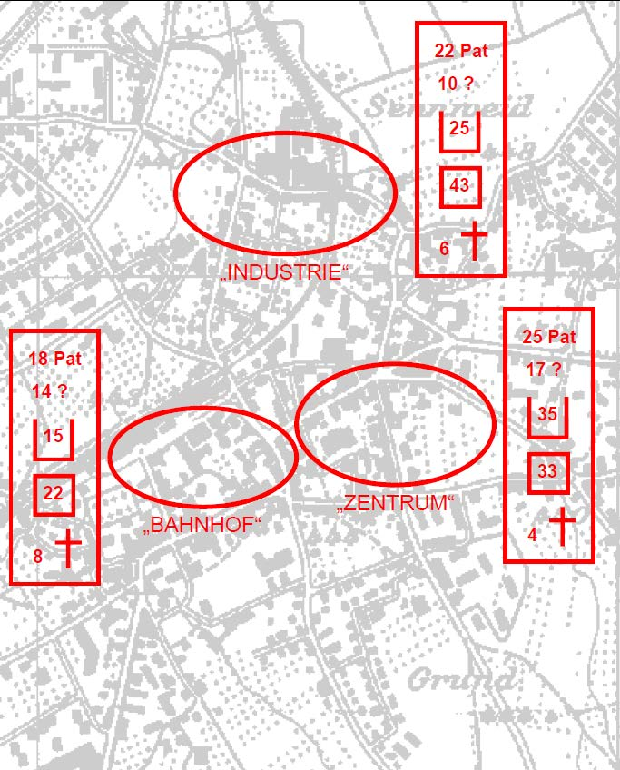
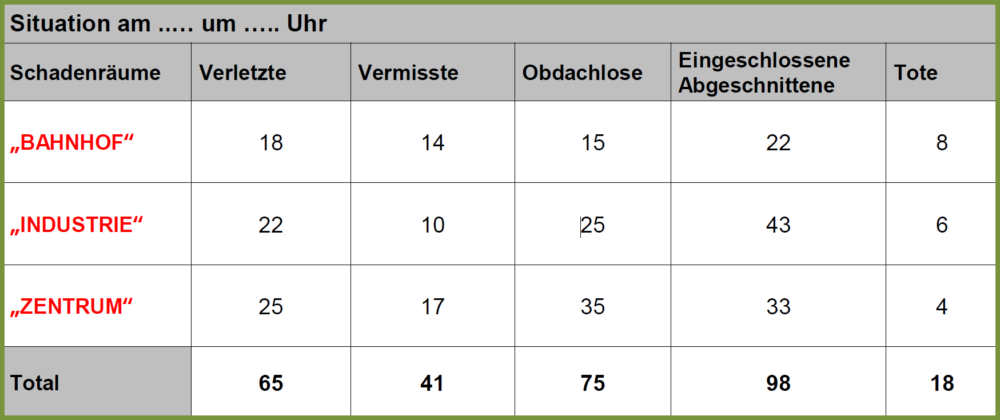
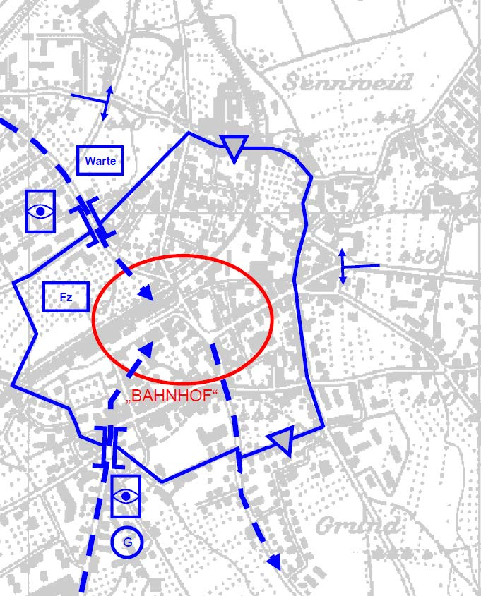

 
## Evakuationsdispositiv - ein Beispiel eines Dispositivs

Das Evakuationsdispositiv ist die graphische Darstellung der Evakuationsräume, Evakuations-abschnitte, Evakuationsachsen und Sammelstellen sowie der für die Aktion benötigten Organe und Mittel, aber auch der allenfalls zu berücksichtigenden Zeitfaktoren, Gefahren sowie Schutz- und Verhaltensmassnahmen.

### Grafische Darstellung

 
## Evakuationsübersicht

Die Evakuationsübersicht ist der tabellarische Überblick über zu evakuierende bzw. bereits evakuierte Räume, Personen, Tiere, Sachwerte und Kulturgüter.

### Tabellarische Darstellung

 
## Meteoübersicht

Die Meteoübersicht gibt grundsätzlich die aktuelle - wenn immer möglich, die lokale - Wetterlage sowie die Wetterprognose wieder. Zentral dabei sind natürlich die Meteodaten über Nieder-schlagsformen, Niederschlagsmengen, Windrichtung, Windgeschwindigkeit und Temperaturen.

### Tabellarische Darstellung

 
## Personenbergungsübersicht

Die Personenbergungsübersicht vermittelt in graphischer und/oder tabellarischer Form einen Überblick über Anzahl und Standorte (allenfalls nur vermutete Anzahl und Standorte) aller unverletzt, verletzt und/oder tot Geborgener sowie aller eingeschlossener wie abgeschnittener, noch vermisster und/oder obdachloser Personen.

### Grafische Darstellung

 

 
## Verkehrsdispositiv

Das Verkehrsdispositiv ist die graphische Darstellung der Verkehrsführung und Verkehrs-einrichtungen, insbesondere der Absperrungen, Umleitungen und Passiermöglichkeiten, aber auch der Einsatz-, Rettungs- und Logistikachsen sowie von Einweisposten, Treffpunkten, Warte-raum, Fahrzeugpark und/oder Geniemittelpool.

### Grafische Darstellung

 
 
 
 