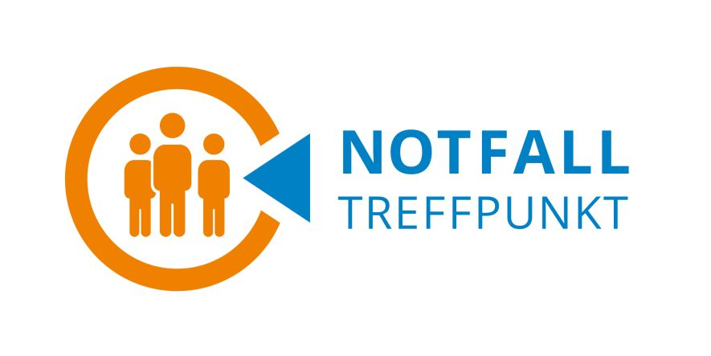

### NTP Informationen

**Allgemines:**

* Beim Versagen der Telefonverbindungen bei längerfristigen Stromausfällen
* 28 Standorte in Brugg Region
* Grundsätzlich sind die AdFW und AdZS nur für die Sicherstellung sowie das Betreiben der Kommunikation (Polycom) zuständig.
* Für den Betrieb des NTP ist die jeweilige Gemeinde verantwortlich. Diese  stellen entsprechendes Personal schnellstmoeglich zur Verfügung.

**Einsatzbereitschaft innerhalb von:**

* x+10 Min. Verbindungen durch AdFW (Basis Kommandoakte FW)
* x+60..120 Min. Besetzung durch AdZS (Unterstützer und Betreuer) / Abloesung der AdFW
* Zusätzlich: Schnellstmögliche Besetzung durch Gemeindepersonal

**Aufgaben ZSO:**

* Lagern zentral die NTP Ausrüstungen (exkl. Polycom) in Schinznach Bad
* Stellen dem RFO das benötigte Personal fuer den KP Betrieb (Lage und Kommunikation sowie die Eingangskontrolle) zur Verfuegung 
* Erstellen einen Ablöseplan fuer die AdZS
* Stellt die Ausbildung fuer FW und RFO auf den Polycom sicher 
* Stellt Verpflegung und Logistik fuer KP und NTP sicher 
* Unterstützt Gemeinden bei Evakuierungen

**NTP Regeln:**

* Aufruf per Offenfunk!
   * Polizei  (Feuerwehr) "BÖZBERG" --> OG  1426
   * Sanität  "SANO AARGAU" --> OG  1427

* KEIN Einzelruf / Direktruf
  * Auch untereinander nicht
  * Grund: Wir haben nur 7 Sprech-Kanäle
  * Direktrufe blockieren 1 Kanal, längere Zeit

* Rote Emergency-Taste
  * Nur bei Angriff auf Euch selber
  * Loest groessere Sofortmassnahmen aus

