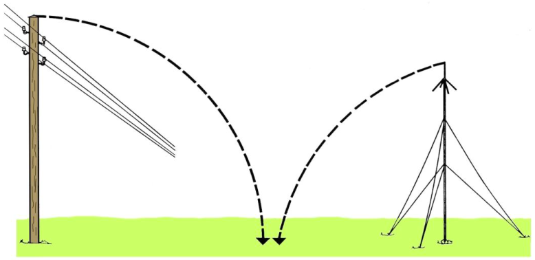
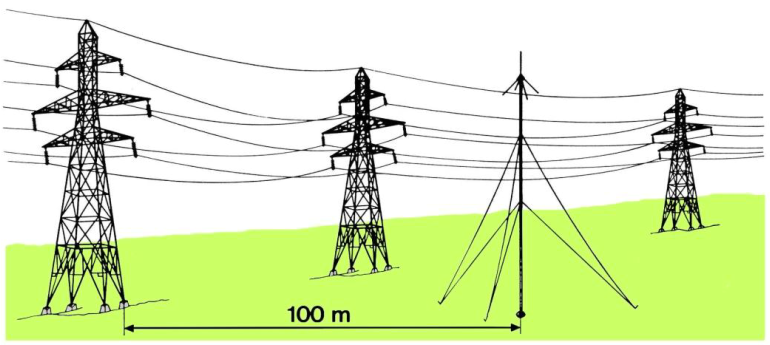
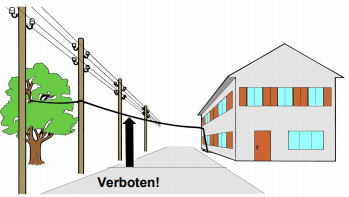
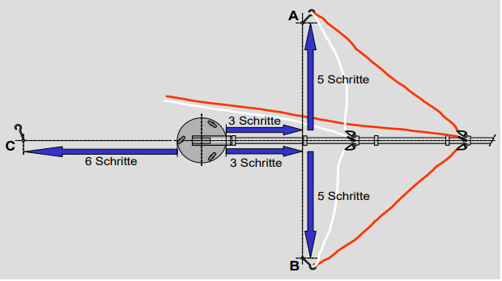
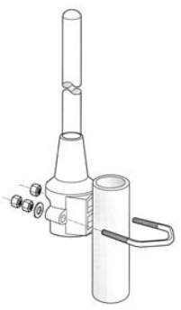
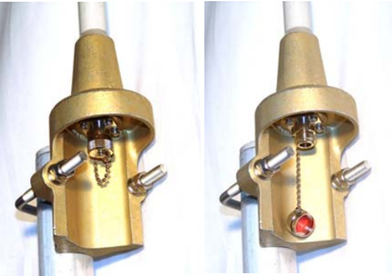
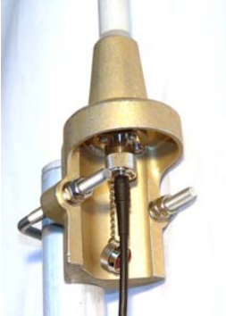

## Sicherheitsvorschriften Antennen

**Hinweise**: Antennendrähte dürfen weder Stark- noch Schwachtrom-Freileitungen kreuzen (<ins>Ausnahme:</ins> Feldleitungen zugunsten des Bevölkerungsschutzer). Dies gilt insbesondere für Langdrahtantennen und Wurfantennen.

Das Verhalten von Personen bei Arbeiten mit mobilen Sende-Empfansanlagen im Bereich von Starkstromanlagen wird in den "**Weisungen über die Verhütung gesundheitlicher Schädigungen im Zivilschutz (Sicherheitsvorschriften)**", Nr. 1121-51-d geregelt. [Download (361KB)](ZSOSicherheitsvorschriften.pdf)

## Montageanleitungunen
### Aufbau 4-teilige Antenne

Für die Montage werden **mindestens 2 Personen** benötigt!

1. Komplettes Material SEA 400 T mitnehmen und den geeigneten Standort auswählen. Antenne immer gegen den Wind aufstellen.
2. Antennenfuss **fixieren**.
3. Mastrohre eins und zwei zusammenpassen und auf den Antennenfuss stecken. Am zweiten Mastrohr **ca. 30 cm unterhalb** des verjüngten Endes eine Abspannbride befestigen.
4. Mastrohre drei und vier zusammenpassen und auf die beiden ersten Mastrohre stecken. Am vierten Mastrohr **ca. 30 cm oberhalb** des Rohrstosses eine weitere Abspannbride befestigen.
5. Heringe nach entsprechender Anzahl normaler Schritte in den Boden einschlagen. (Die Schritte zählt die **gleiche Person** ab.)
6. **Weisse Abspannschnüre** mit dem Karabinerhaken an der **unteren** Abspannbride und an den Heringen A und B einhängen.
7. **Rote Abspannschnüre** mit dem Karabinerhaken an der **oberen** Abspannbride und an den Heringen A und B einhängen.
8. Antennenmast mit Hilfe der Abspannschnüre rot und weiss aufziehen, einhängen und **ausrichten**. Anschliessend mit Hilfe der Abspannschnüre wieder ablegen. Den Antennenkopf mit den entsprechenden Antennenstäben auf den Antennenmast stecken.
9. Das **Koaxialkabel** mit Hilfe der Antennenkabelhalter an den aMastrohren befestigen und **Antennenmast** mit aufgesetztem Antennenkopf wieder **aufziehen**; **Abspannschnüre** rot und weiss **nachspannen**.

### Aufbau 3-teilige Antenne
Die Montage funktioniert gleich wie bei der 4-teiligen Antenne, jedoch wird auf das vierte Mastrohr und und die roten Abspannschnüre verzichtet.

### Montage Antennenkopf (POLYCOM)
Der Polycom-Adapter wird seitlich an der Mastspitze befestigt, wobei die Kabelführung ausserhalb des Mastrohrs verläuft.
 

Die Steckerkappe schützt die Buchse vor Verschmutzung und Beschädigung. Das Entfernen der Steckerkappe ist **NUR** erlaubt, wenn ein Kabel angeschlossen werden soll!
 

Die Steckerkappe entfernen und das Kabel mit dem Stecker anschliessen. Der Stecker-Gewindering vorsichtig auf das Gewinde drehen und mit der Hand fest anziehen. **Keine Zangen** oder andere Werkzeuge verwenden!
 

 
