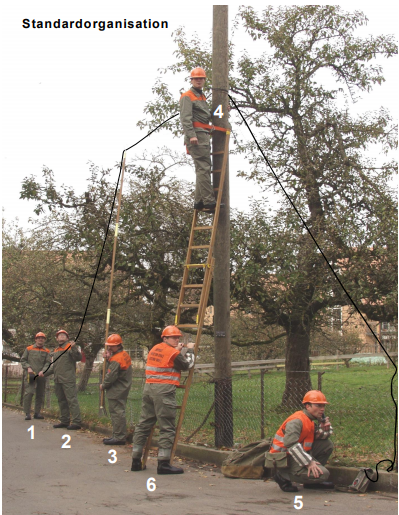
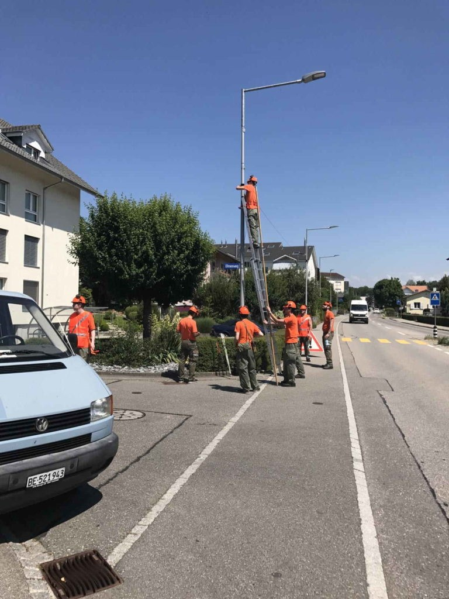

 
## Standardorganisation

Der Leitungsbau hat gegenüber andern Telefoniemöglichkeiten den Vorteil, dass die Verbindungen ohne Abhängigkeit von einem Anbieter selber
betrieben und unterhalten werden können. Solche Verbindungen funktionieren auch dann noch, wenn das öffentliche Telefonnetz überlastet
oder ausgefallen ist.

 

### Aufstellung
1. Rollenmann
2. Schaufelmann (Materialträger)
3. Stangenmann
4. Steiger (Leiterträger)
5. Träger
6. Verbinder (Verkehrshelfer)
7. Verkehrshelfer

#### Gruppenführer

<ins>Aufgabe</ins>: Ist verantwortlich für zweckmässige Organisation und Ausrüstung der Baupatrouille und für eine betriebssichere Ausführung des Leitungsbaus.

#### 1. Rollenmann

<ins>Aufgabe</ins>: folgt dem befohlenen Trassee und rollt das Kabel ab

<ins>Material</ins>: Auf- und Abspulvorrichtung, Kabelrolle, Bindestrick

#### 2. Schaufelmann

<ins>Aufgabe</ins>: hilft dem Stangenmann beim Hochverlegen des Kabels, erstellt die Sicherungen tief

<ins>Material</ins>: Baupatrouille-Wagen, Bodenbau-Material

#### 3. Stangenmann

<ins>Aufgabe</ins>: verlegt in Zusammenarbeit mit dem Schaufelmann das Kabel hoch

<ins>Material</ins>: Gabelstange 3-teilig, Kabelaufhängehaken

#### 4. Steiger

<ins>Aufgabe</ins>: bringt die Stützpunkte und Sicherung hoch an

<ins>Material</ins>: Schiebeleiter 2-teilig, Haltegurte, Stützpunkt-Material, Isoliermaterial

#### 5. Träger

<ins>Aufgabe</ins>: stellt die Sicherung des Leiters her, Zusammenarbeit mit Steiger

<ins>Material</ins>: Schiebeleiter 2-teilig, Support-Material für Steiger

#### 6. Verbinder

<ins>Aufgabe</ins>: erstellt die Kabelverbindungen, führt die Linienkontrolle durch, hilft beim Sperren von Strassen

<ins>Material</ins>: Linientasche, Feldtelefonstation, Material für Verkehrshelfer

#### 7. Verkehrshelfer

<ins>Aufgabe</ins>: Sperren von Strassen

<ins>Material</ins>: Material für Verkehrshelfer

 

 
 
 
 