## Sicherungen
Bei Sicherungen sind Richtungswechsel **erlaubt**!

### Mastwurf einfach
<a href="MW1.PNG?origin=Telematik/Leitungsbau_5_-_Sicherungen_&_Stützpunkte.md">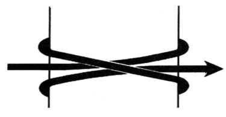</a>

### Mastwurf doppelt
<a href="MW2.PNG?origin=Telematik/Sicherungen.md">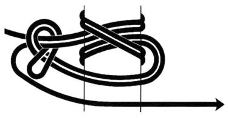</a>

### Kabelträger aus Metall
<a href="KTM1.PNG?origin=Telematik/Leitungsbau_5_-_Sicherungen_&_Stützpunkte.md">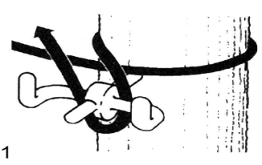</a>

<a href="KTM2.PNG?origin=Telematik/Leitungsbau_5_-_Sicherungen_&_Stützpunkte.md">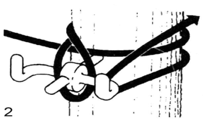</a>

<a href="KTM3.PNG?origin=Telematik/Leitungsbau_5_-_Sicherungen_&_Stützpunkte.md">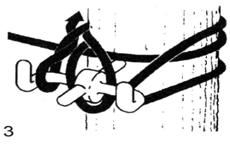</a>

<a href="KTM4.PNG?origin=Telematik/Leitungsbau_5_-_Sicherungen_&_Stützpunkte.md">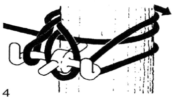</a>

**Hinweis**: Das Anbringen von Kabelträgern aus Metall an Bäumen ist untersagt!

### Sicherung mit Manschette
<a href="MS1.PNG?origin=Telematik/Leitungsbau_5_-_Sicherungen_&_Stützpunkte.md">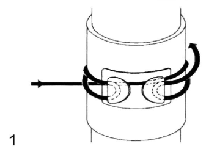</a>

<a href="MS2.PNG?origin=Telematik/Leitungsbau_5_-_Sicherungen_&_Stützpunkte.md">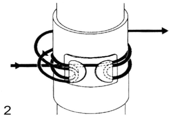</a>

### V-Sicherung am Baum

<a href="VSICH.PNG?origin=Telematik/Leitungsbau_5_-_Sicherungen_&_Stützpunkte.md">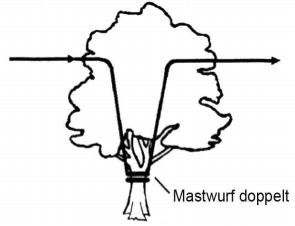</a>

**Ausführung:**
1. Kabel mit Gabelstange auf den Baum legen
2. Zwischen zwei Auflagepunkten mit Gabelstange nach unten ziehen
3. Mastwurf möglichst hoch am Stamm oder Ast sichern (ohne Leiter zu besteigen)

### Arretierbaumschleife am Baum

<a href="schleife.PNG?origin=Telematik/Leitungsbau_5_-_Sicherungen_&_Stützpunkte.md">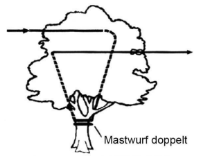</a>

**Ausführung:**
1. Kabel über einen Ast legen und nach unten ziehen
2. Mit Mastwurf möglichst hoch am Stamm oder an einem Ast sichern (ohne Leiter zu besteigen)
3. Abgehendes Kabel wieder hoch wegführen
4. Das Objekt nicht umgehen

### Telefonstange mit Übergang Hoch-/Bodenbau

<a href="HB1.PNG?origin=Telematik/Leitungsbau_5_-_Sicherungen_&_Stützpunkte.md">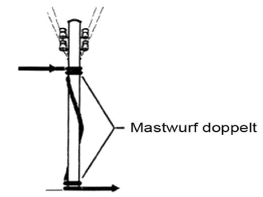</a>

### Baum mit Übergang Hoch-/Bodenbau

<a href="HB2.PNG?origin=Telematik/Leitungsbau_5_-_Sicherungen_&_Stützpunkte.md">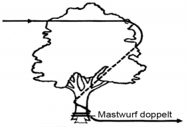</a>

## Stützpunkte

Bei Stützpunkten sind Richtungswechsel **nicht erlaubt**!

### Kabelträger aus Metall

<a href="KTM.PNG?origin=Telematik/Leitungsbau_5_-_Sicherungen_&_Stützpunkte.md">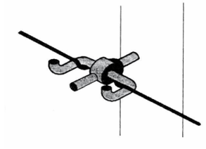</a>

**Anwendung:** Stützpunkt an Holzmasten

### Kabelträger aus Kunststoff

<a href="KTK.PNG?origin=Telematik/Leitungsbau_5_-_Sicherungen_&_Stützpunkte.md">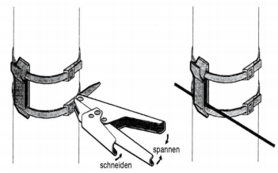</a>

**Anwendung:** Isolierender Stützpunkt an Metallstangen (Befestigung der Kabelbinder mit Spannzange)

### Kabelaufhängehaken

<a href="KAH.PNG?origin=Telematik/Leitungsbau_5_-_Sicherungen_&_Stützpunkte.md">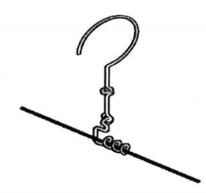</a>

**Anwendung:** Stützpunkt an Gebäuden oder Bäumen (Vorsicht bei instabilen Dachrinnen oder morschen Ästen)

### V-Schlaufe

<a href="VSCHL.PNG?origin=Telematik/Leitungsbau_5_-_Sicherungen_&_Stützpunkte.md">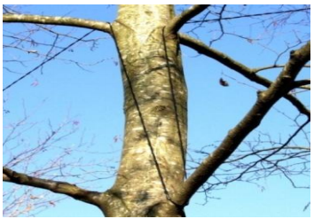</a>

**Anwendung:** Stützpunkt an Bäumen (Vorsicht bei morschen Ästen)

### Rollenverbindung

Neigt sich eine Rolle dem Ende, wird die nächste Rolle wie folgt verbunden:

1. Beide Kabelenden mit Mastwurf sichern
2. Kabel miteinander verknoten (Zugsentlastung)
3. Die Spitzen mit Klemm- oder Schraubverbinder verbinden
4. Linienkontrolle durchführen

### Linienkontrolle

Bei der Linienkontrolle ruft die Baupatrouille die Anfangsstation auf. Funktioniert die Verbindung, wird Folgendes durchgegeben:
* Wie viele Rollen sind bereits abgerollt worden
* Zeit
* Standort

 