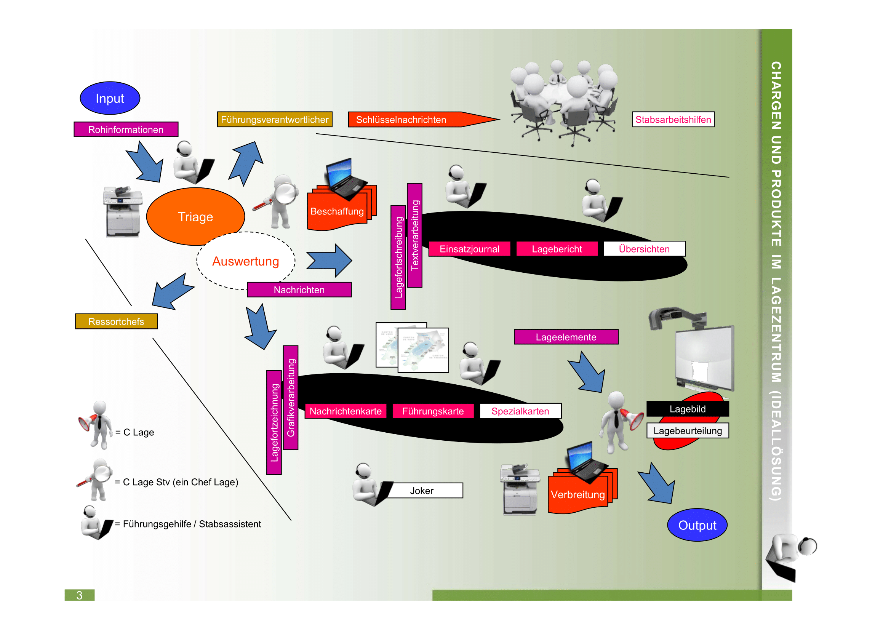

## Funktionsträger im Lagezentrum 

Der Lageverarbeitungszyklus (Beschaffung, Auswertung, Verbreitung) wird im Lagezentrum von einem Lageorgan sichergestellt. **Im Lageorgan** findet man die **Funktionsträger**…

Grundsätzlich sind im Lagezentrum **ein Chef Lage** (idealerweise gar zwei ausgebildete Chefs Lage, einer als Stellvertreter) sowie mehrere Stabsassistenten bzw. Führungsgehilfen tätig. Einem Stabsassistenten (bzw. Führungsgehilfen) kann der Leadership für die organisatorische Führung der Stabsassistenten (bzw. Führungsgehilfen) zugewiesen werden. Allenfalls steht dafür sogar ein Gruppenführer Lage zur Verfügung.

## Aufgaben des Chefs Lage im Rahmen des Lagezentrums

* Ausrichten der Köpfe des Lageorgans auf die **Vorgaben der Führung**
* Beeinflussen der **Tätigkeiten** im **Lageverarbeitungszyklus**
* Verfolgen der **Lageentwicklung** im Sinne der **Lagekontrolle**
* Erkennen von **Widersprüchen**, **Fehlern** und **Lücken** im Lagebild
* Erfassen und Strukturieren der **Lageelemente** zu einem **Lagebild**
* Entwickeln der **Lagebeurteilung** insbesondere auch von **Entwicklungsmöglichkeiten**

## Aufgaben der Stabsassistenten/Führungsgehilfen im Rahmen des Lagezentrums

Die **Stabsassistenten** bzw. **Führungsgehilfen** nehmen im Lagezentrum verschiedenste **Chargen** wahr. Solche Chargen können sein...
* Triagist
* Einsatzjournalführer
* Nachrichtenkartenführer
* Lageberichterarbeiter
* Führungskartenersteller
* Bildauswerter (Foto, Video)
* OSINT-Auswerter (Öffentlich zugängliche Quellen)
* ...

Im Lagezentrum **gruppiert man** idealerweise **Chargen**, welche sich **mit der textlichen Verarbeitung der Lage** auseinandersetzen - also **Triage**, **Einsatzjournalführung** und **Lageberichterarbeitung**. Gute Resultate werden hierbei erreicht, wenn diese Funk-tionsträger eng miteinander kommunizieren.

Weiter existieren **Chargen**, welche sich **mit der grafischen Verarbeitung der Lage** auseinandersetzen - also **Nachrichtenkartenführung, Führungskartenerstellung** und **Bildauswertung** (Foto, Video). 

Wesentlich ist übrigens noch, dass die **Aussagen der Textprodukte** mit den **Aussagen der Grafikprodukte** zueinander **korrespondieren** - also Sicherstellung einer **Synchronisierung**. Konkret bedeutet dies, dass sich beispielsweise die Aussagen von Führungskarte und Lagebericht ergänzen können, sich aber nicht widersprechen sollten. 

## Chargen und Produkte im Lagezentrum (Ideallösung)

