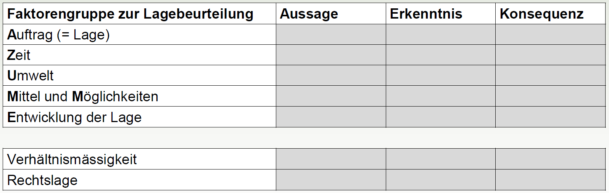

Die elementare Grundlage zum Lösen von Problemstellungen ist eine situationsangepasste Lagebeurteilung, welche von einer fundierten Analyse ausgeht und in einer gerafften Synthese gipfelt.

## Inhalt 
* Aussagen zu Interpretationen / Hypothesen / Entwicklungsmöglichkeiten / Folgerungen / Konsequenzen

## Form 
* unterschieden wird zwischen Analyse und Synthese
* die Analyse der Faktorengruppen (siehe unten) dient als Grundlage für die Erarbeitung der Synthese
* **Analyse** der folgenden Faktorengruppen im Bezug zum Auftrag / Problem:
	- Zeitverhältnisse
	- Umwelt
	- Mittel und Möglichkeiten
	- Entwicklung der Lage
* Präsentiert wird die **Synthese**:
	- Entwicklungsmöglichkeiten / Forderungen / Konsequenzen
	- wahrscheinlichste / gefährlichste Variante*
* allenfalls Einbezug der Beurteilungsschematik Aussage - Erkenntnis - Konsequenz
* allenfalls strukturiert in Lagefelder - analog der Teilprobleme / Aufgabenbereiche aus der Problemerfassung
* Veranschaulichung durch Visualisierung - Hypothese-Flash / Karte / Bild- und Tonmaterial
* Anwendung der Verständlichmacher - Einfachheit / Struktur / Prägnanz / Stimulanz / Visualisierung

 
*Die **wahrscheinlichste Entwicklungsmöglichkeit** ist jene, die aufgrund der vorliegenden **Anzeichen** am ehesten Realität werden kann.

Die **gefährlichste Entwicklungsmöglichkeit** ist jene, welche die **Auftragserfüllung** am schnellsten und nachhaltigsten **in Frage stellt**.

## AEK-Matrix verknüpft mit „AZUME“

 
