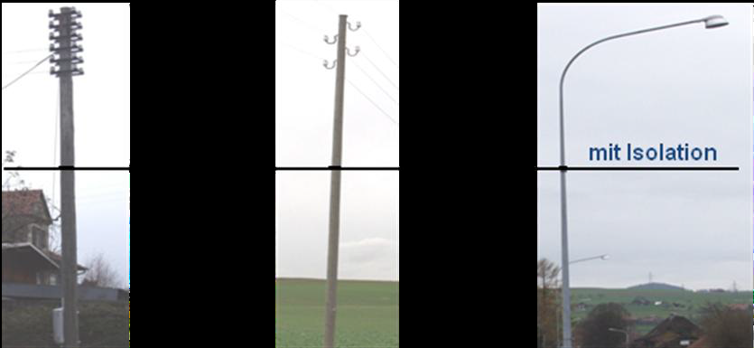
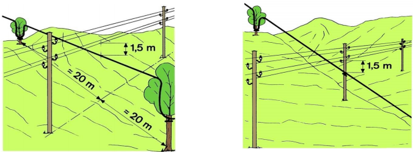
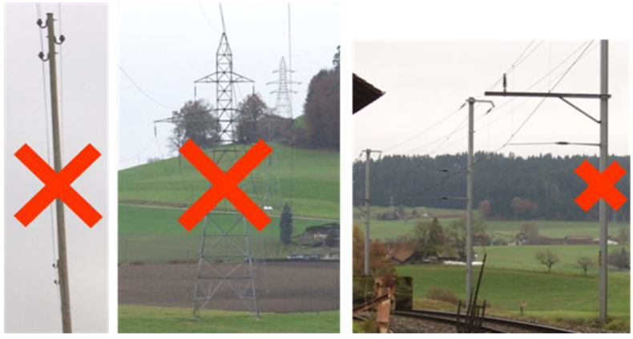
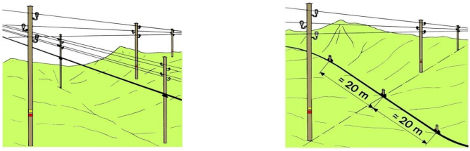

## Mitbenützung von Tragwerken

## Niederspannungsfreileitungen
### Kreuzen

### Parallelführung

## Hochspannungsfreileitungen

**nicht erlaubt**: Mitbenützung von folgenden Tragwerken:

### Kreuzen

### Parallelführung

 

