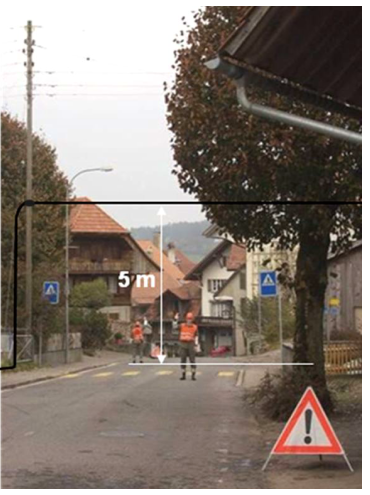
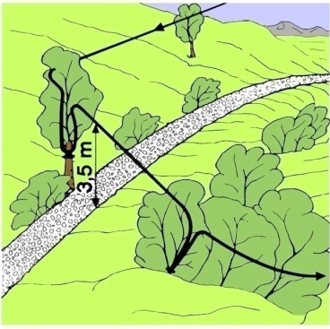
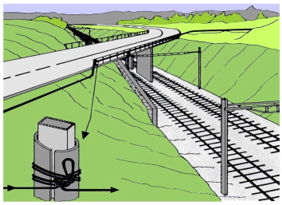
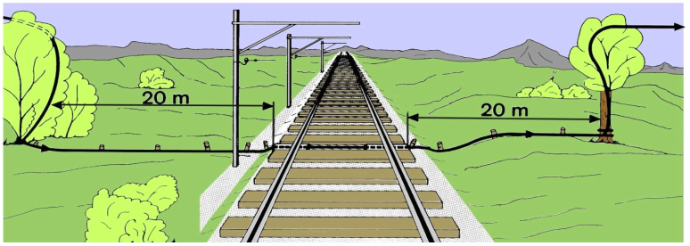
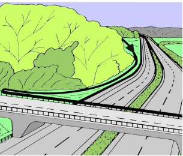

## Strassenkreuzung

### Ablauf vom Kreuzen einer Strasse im Hochbau

1. Sicherung auf der Abgangsseite anbringen (**Höhe beachten**)
2. Sicherung auf der Gegenseite vorbereiten
Komando von Steiger: "**bereit!**"
3. Komando von Gruppenführer: "**Strasse sperren!**"
Rückmeldung von Verkehrshelfer: "**Strasse gesperrt!**"
4. Strasse mit dem Kabel überqueren
5. Kabel auf der Gegenseite sichern
Komando von Steiger: "**gesichert!**"
6. Komando von Gruppenführer: "**Strasse freigeben!**"
Rückmeldung von Verkehrshelfer: "**Strasse frei!**"

### Mindesthöhen und Abstände

* Mindestbauhöhe der Hochbauleitung bei Strassenüberquerung min. **5m**
* Faltsignale nur mit müssen einen Abstand von **50m** innerorts und **150-250m** ausserorts aufweisen
* Faltsignale dürfen nur mit einen Fuss auf der Strasse stehen, die beiden anderen müssen auf dem Trottoir stehen

## Kreuzen von Fusswegen

### Hochbau

### Bodenbau

Beim **Kreuzen von Strassen** und **Wegen** ist das Kabel
* **mindestens 10cm tief einzugraben**
* und **beidseits** der Fahrban zu **sichern**

Beim Kreuzen von Fusswegen und beim Bau über freies Gelände ist das Kabel so zu verlegen, dass **keine Stoplerdrähte** entstehen.

## Kreuzen von Bahnanlagen

### Hochbau

**Auf leitenden Konstruktionen muss das Kabel isoliert werden!**

### Bodenbau

Der Bahnbetreiber **muss** vorgängig informiert werden. Die Kreuzungsstelle muss **beidseitig** markiert werden.

## Kreuzen von Autobahnen

Autobahnen **müssen** bei Unter- oder Überführungen gekreuzt werden.
 

