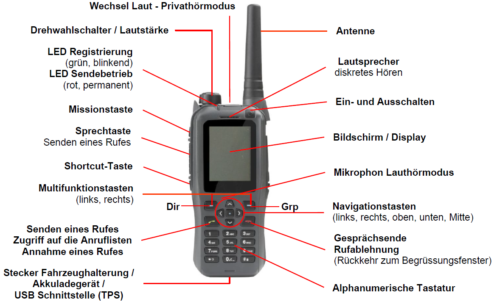
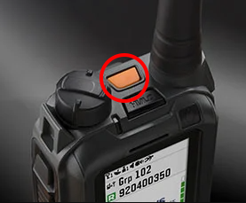
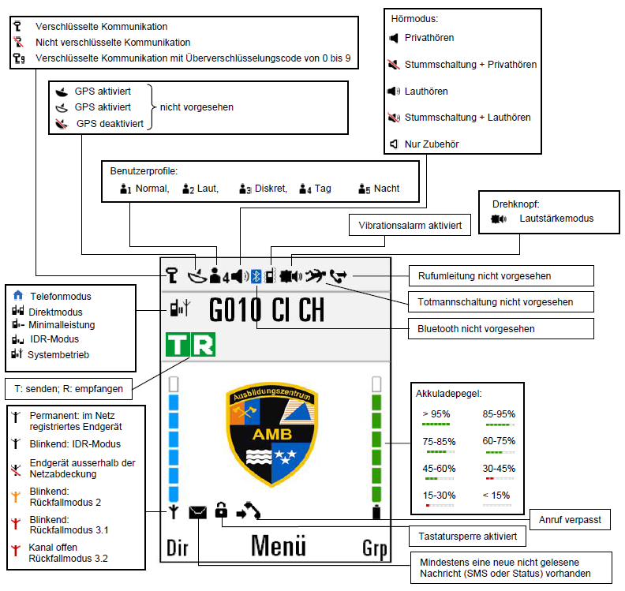
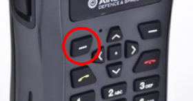
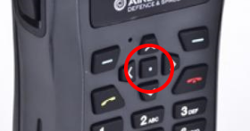
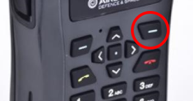
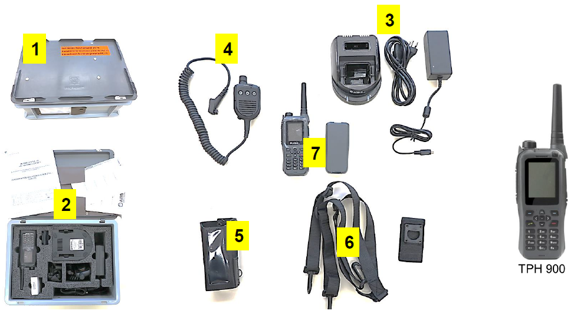
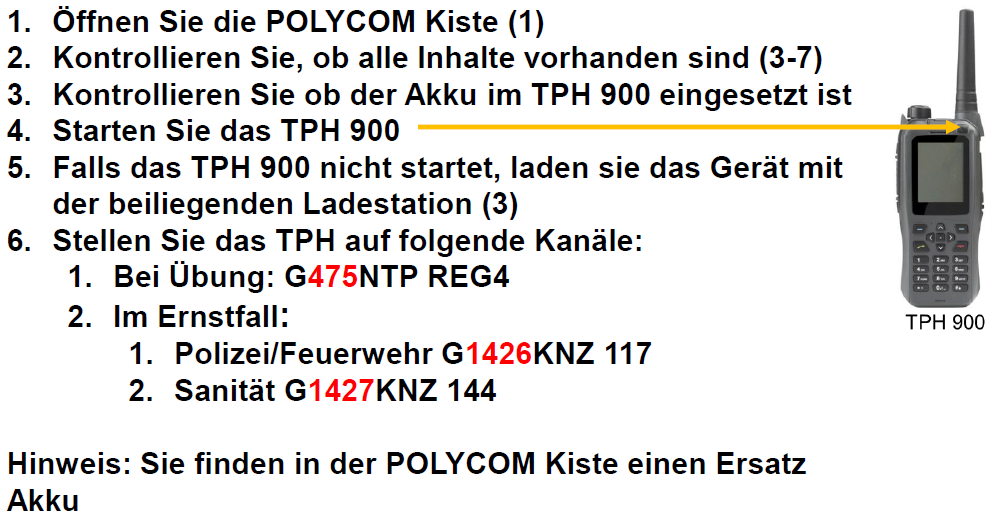
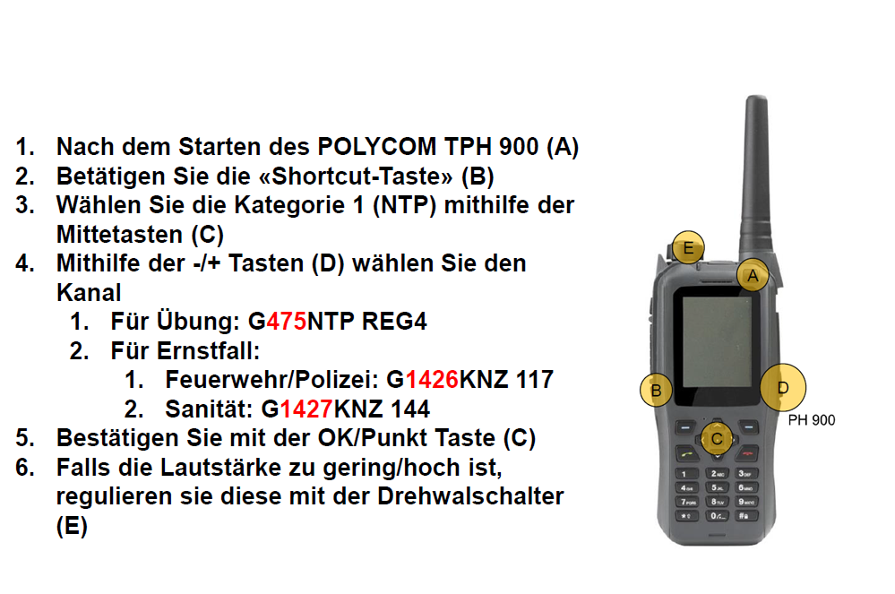

## Legende

### Notruftaste

Bei versehentlichem Auslösen des Notrufknopfes:
* Sobald sich die Einsatzzentrale der Kapo Aargau meldet, **sofort antworten** mit der Bekanntgabe des Namens und die Auslösung des Notknopfes als Fehlmanipulation mitteilen! **Gerät nicht abschalten!**
Beispiel:
„Einsatzzentrale von Hans Muster KFS Aargau; es wurde eine Fehl-
manipulation ausgelöst. Es müssen keine weiteren Massnahmen
getroffen werden! Schluss!“

## Display & Symbole

## Tasten

### Linke Multifunktionstaste

* **Im Begrüssungsfenster:** Die Taste ist der Registerkarte (Dir) zugeordnet und wird für den Zugriff auf die an der TPS programmierten Kanäle im DIR- und im IDR-Modus verwendet.
* **Weitere Verwendung:** Die Taste ist der Registerkarte (Löschen) zugeordnet.

### Navigationstaste Mitte

* **Im Begrüssungsfenster:** Die Taste ist der Registerkarte (Menü) zugeordnet und wird für den Zugriff auf die Menüliste verwendet.
* **Navigation in einem Menü:** Die Taste ist der Registerkarte (Eintreten) zugeordnet und wird für eine Aktivierung verwendet.

### Rechte Multifunktionstaste

* **Im Begrüssungsfenster:** Die Taste ist der Registerkarte (Grp) zugeordnet und wird für den Zugriff auf die vom Netz verteilten Gruppenkommunikationen verwendet.
* **Navigation im Menü:** Die Taste ist der Registerkarte (Zurück) zugeordnet und wird für einen Abbruch verwendet.
* **Weitere Verwendung:** Aktivieren der Stummschaltung nach dem Empfangen eines Rufes.

## Betriebsarten

### Systembetrieb (S)
Kommunikation über die POLYCOM-Infrastruktur. Senden / Empfangen zwischen allen Geräten derselben OG möglich. Individual Calls direkt auf eine bestimmte RFSI-Nr. möglich.

### Directmode (D)
Kommunikation an alle Geräte im Empfangsbereich. Senden / Empfangen an alle Geräte, die denselben DMO-Kanal benutzen.

### Relaismode (R)
Kommunikation über IDR. Senden / Empfangen zwischen allen Geräten in IDR-Reichweite mit denselben OG-Einstellungen.

## Funkmaterial NTP

### Inhalt NTP-Koffer

### Inbetriebnahme POLYCOM TPH 900

### Kanalwahl/Wechsel POLYCOM TPH 900

 
