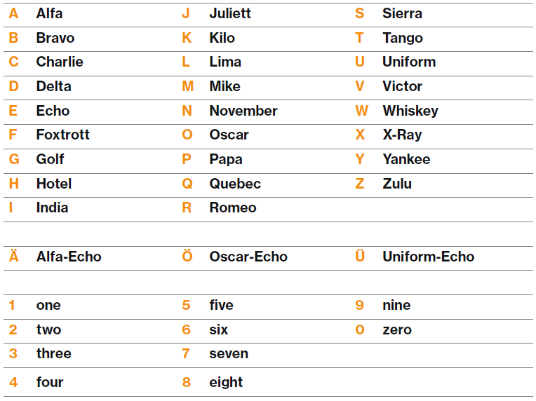
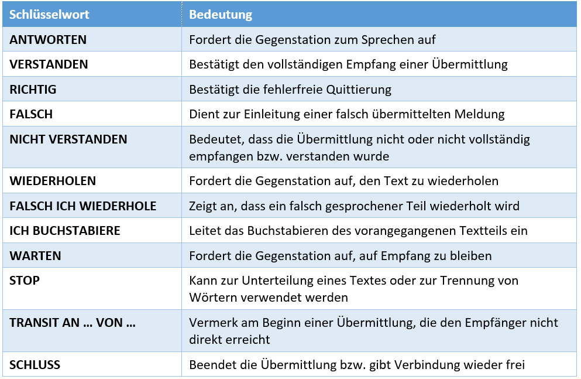
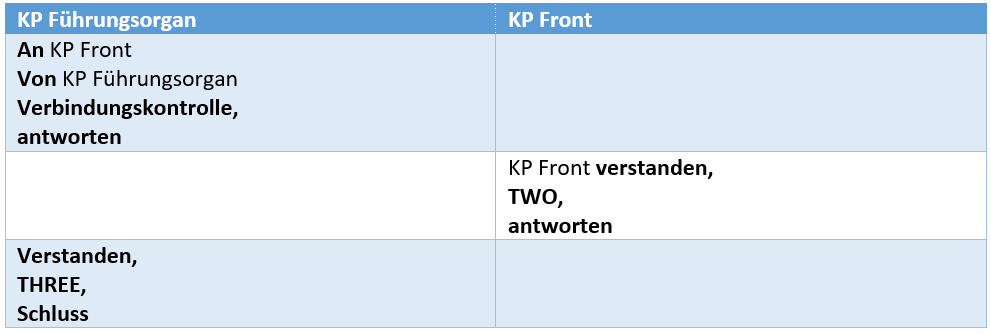
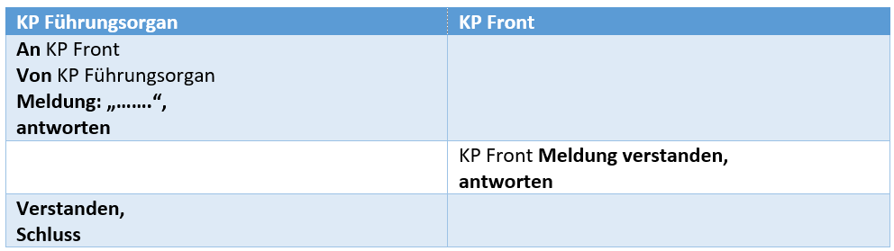
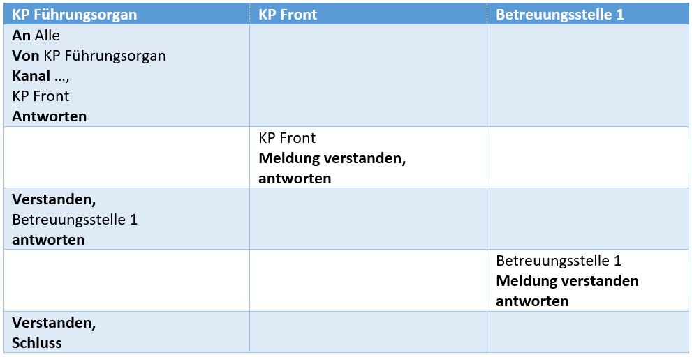

## DDSSS

**D**enken 
**D**rücken 
**S**chlucken 
**S**chauen (rote LED) 
**S**prechen

 
## Buchstabiertabelle

## Schlüsselwörter

**AN** 
Leitet ein Gespräch ein

**ANTWORTEN** 
Fordert Gegenstation zum Sprechen auf

**VERSTANDEN** 
Bestätigt den Empfang

**NICHT VERSTANDEN** 
Zeigt an, dass die Meldung nicht vollständig verstanden wurde

**WIEDERHOLEN** 
Fordert zur Wiederholung der Meldung auf

**RICHTIG/FALSCH** 
Bestätigt Ferhlerfreiheit einer Quittung

**SCHLUSS** 
Beendet das Gespräch

## Redewendungen

Gliederung der Übermittlung nach Inhaltsbezeichnung:
* Meldung
* Befehl
* Anfrage
* Antwort
* Verbindungskontrollen

## Verbindungskontrolle

Eine Verbindungskontrolle ist in folgenden Fällen erforderlich:

* Bei der ersten Verbindungsaufnahme
* Nach einem Standortwechsel
* Nach einem Gruppen- oder Kanalwechsel
* Nach einem Antennenwechsel
* Sicherheit (z.B. Einsatz, Intervention)

Eine Verbindungsqualität wird wie folgt angegeben:

**"ONE"**, Schlechte bis unbrauchbare Verständlichkeit (Ein Standortwechsel ist zwingend nötig)

**"TWO"**, Knappe bis genügende Verständlichkeit (Wiederholungen sind möglich)

**"THREE"**, Gute bis sehr gute Verständlichkeit

## Beispiele

### Durchführung einer Verbindungskontrolle

### Funkverkehr mit zwei Teilnehmern

### Kanalwechsel

 